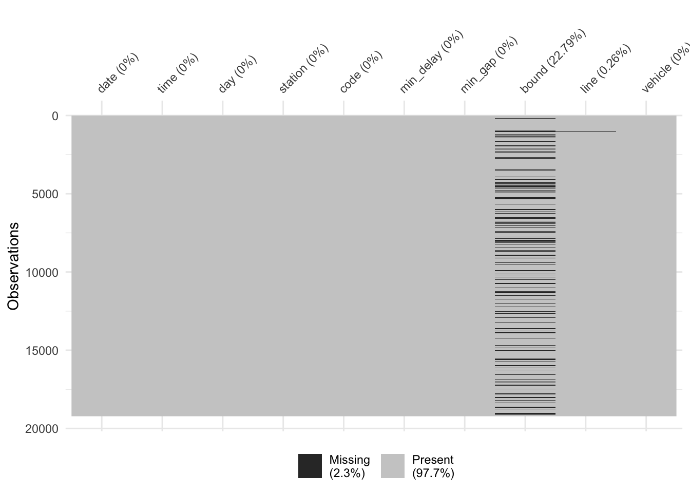
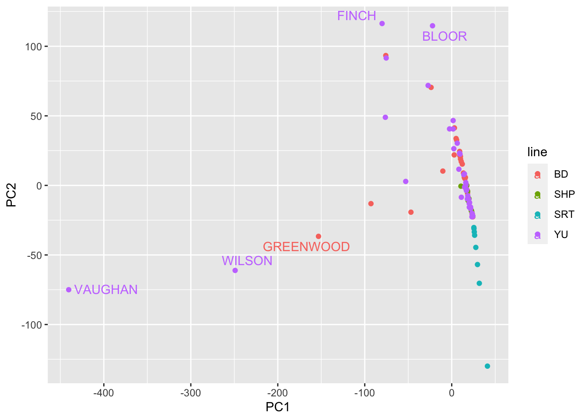
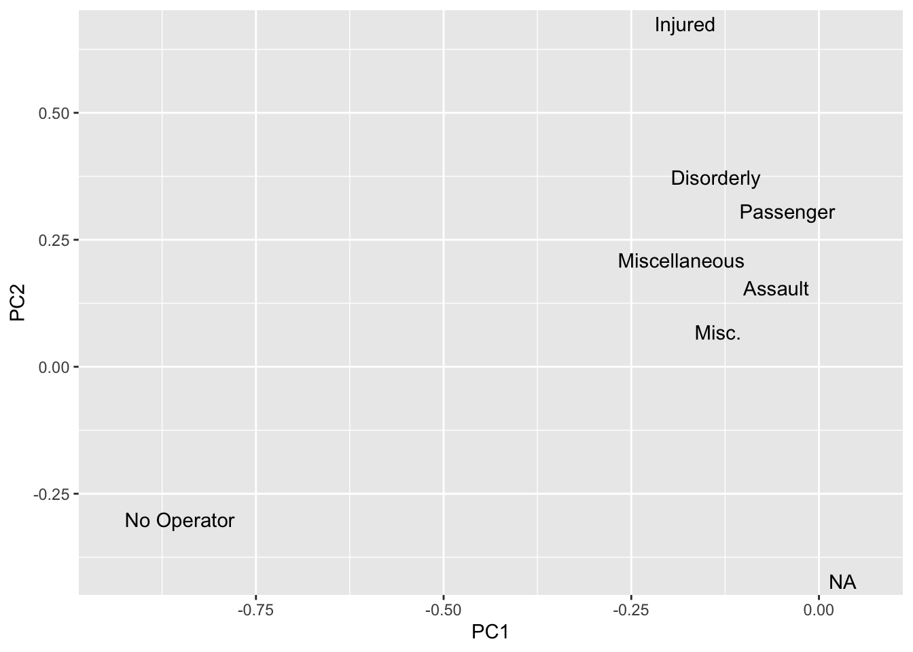
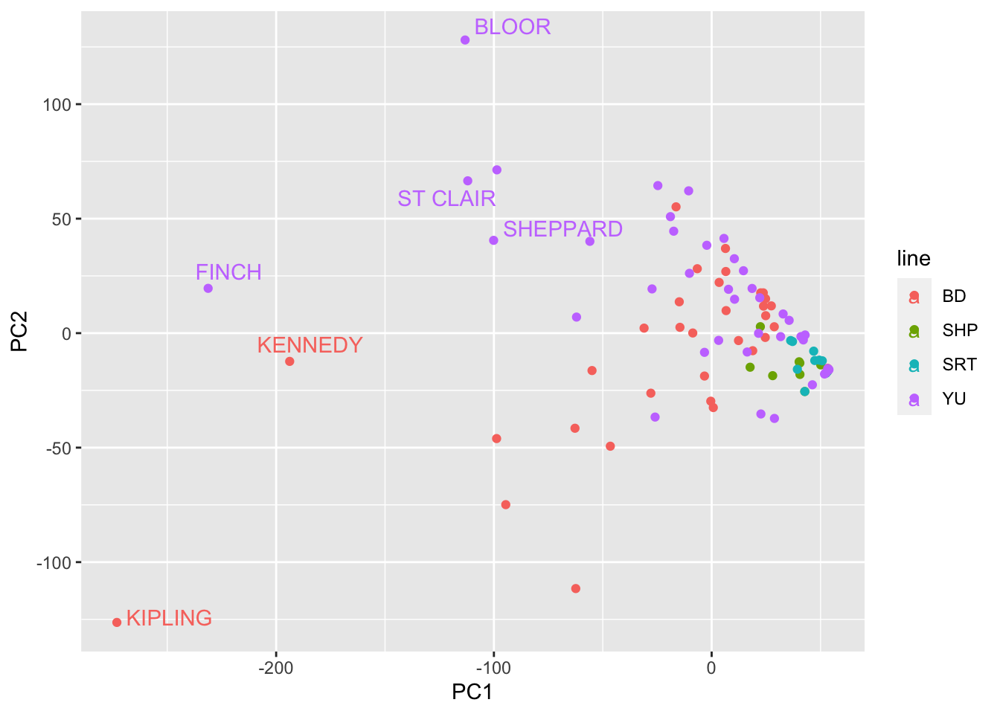
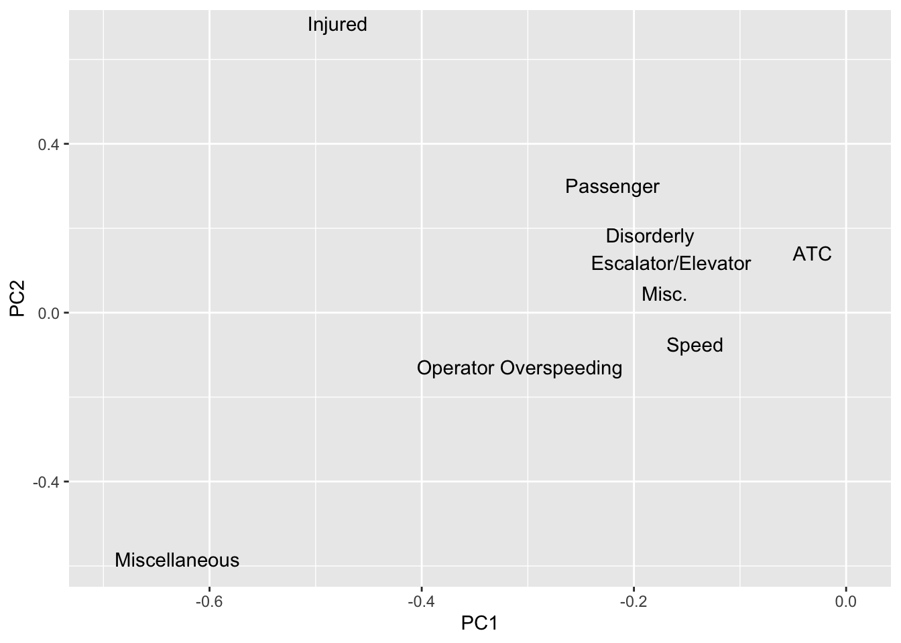
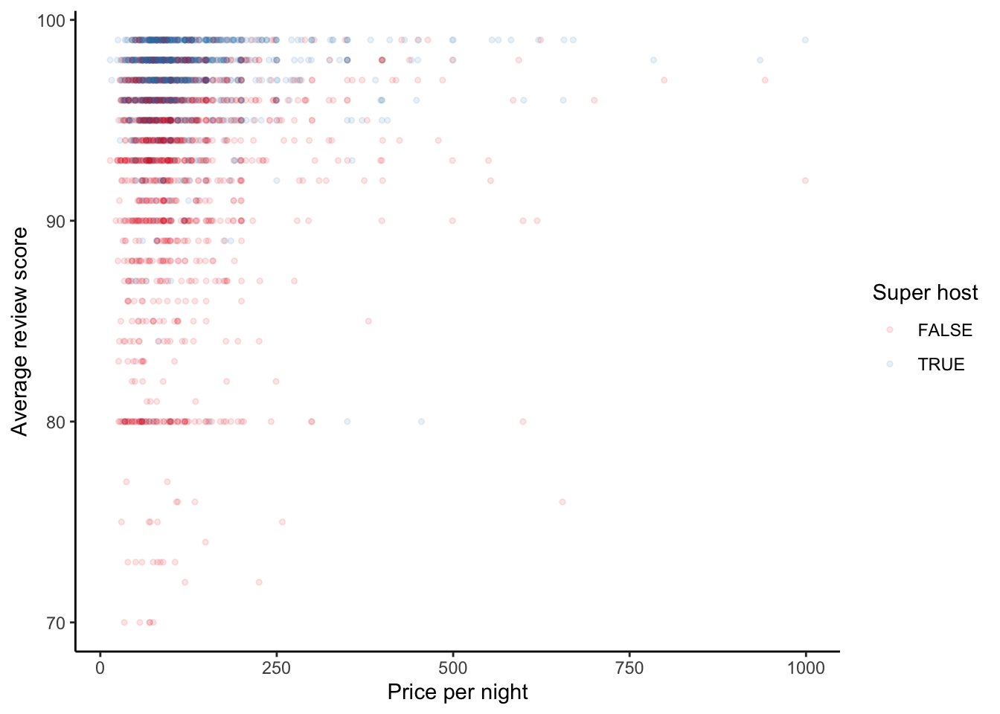

# (PART) Modelling {-}

# Exploratory data analysis

**STATUS: Under construction.**

**Required reading**

- Barocas, Solon, and Danah Boyd, 2017, 'Engaging the ethics of data science in practice', *Communications of the ACM*, 60.11 (2017): 23-25.
- DiCiccio, Thomas J., and Mary E. Thompson, 2004, 'A Conversation with Donald A. S. Fraser', *Statistical Science*, 19 (2) pp. 370-386, https://utstat.toronto.edu/craiu/DonFraser_SSInterview.pdf.
- Jordan, Michael I, 2019, 'AI - The revolution hasn't started yet', *Harvard Data Science Review*, 1 July, https://hdsr.mitpress.mit.edu/pub/wot7mkc1.
- Tukey, John W., 1961, 'The Future of Data Analysis', *The annals of mathematical statistics*, Part 1 'General Considerations', https://projecteuclid.org/journals/annals-of-mathematical-statistics/volume-33/issue-1/The-Future-of-Data-Analysis/10.1214/aoms/1177704711.full.
- Wickham, Hadley, and Garrett Grolemund, 2017, *R for Data Science*, Chapters 3 and 7, https://r4ds.had.co.nz/.


<!-- **Recommended reading** -->

<!-- - Hall, Megan, 2019, 'Exploratory Data Analysis Using Tidyverse', https://hockey-graphs.com/2019/10/08/exploratory-data-analysis-using-tidyverse/. -->
<!-- - Kommenda, Niko, Helen Pidd and Libby Brooks, 2020, 'Revealed: the areas in the UK with one Airbnb for every four homes', *The Guardian*, 20 February, https://www.theguardian.com/technology/2020/feb/20/revealed-the-areas-in-the-uk-with-one-airbnb-for-every-four-homes. -->
<!-- - Silge, Julia, 2018, 'Understanding PCA using Stack Overflow data', https://juliasilge.com/blog/stack-overflow-pca/. -->
<!-- - Soetewey, Antoine, 2020, 'Descriptive statistics in R', https://www.statsandr.com/blog/descriptive-statistics-in-r/. -->
<!-- - Stodulka, Jiri, 2019, 'Toronto Crime and Folium', https://www.jiristodulka.com/post/toronto-crime/. -->
<!-- - Wong, Julia Carrie, 2020, 'One year inside Trump's monumental Facebook campaign', The Guardian, 29 January, https://www.theguardian.com/us-news/2020/jan/28/donald-trump-facebook-ad-campaign-2020-election. -->


**Key concepts/skills/etc**

- Quickly coming to terms with a new dataset by constructing graphs and tables.
- Understanding the issues and features of the dataset and how this may affect your modelling decisions.
- Thinking about missing values and outliers.


**Key libraries**

- `broom`
- `ggrepel`
- `here`
- `janitor`
- `lubridate`
- `opendatatoronto`
- `tidymodels`
- `tidyverse`
- `visdat`


**Key functions/etc**

- `augment()`
- `clean_names()`
- `coord_flip()`
- `count()`
- `distinct()`
- `facet_grid()`
- `facet_wrap()`
- `geom_bar()`
- `geom_col()`
- `geom_density()`
- `geom_histogram()`
- `geom_line()`
- `geom_point()`
- `geom_smooth()`
- `geom_text_repel()`
- `get_dupes()`
- `glance()`
- `if_else()`
- `ifelse()`
- `initial_split()`
- `left_join()`
- `mutate()`
- `mutate_all()`
- `names()`
- `ncol()`
- `nrow()`
- `pivot_wider()`
- `scale_color_brewer()`
- `scale_fill_brewer()`
- `scale_x_log10()`
- `scale_y_log10()`
- `str_detect()`
- `str_extract()`
- `str_remove()`
- `str_split()`
- `str_starts()`
- `summarise()`
- `summarise_all()`
- `theme_classic()`
- `theme_minimal()`
- `vis_dat()`
- `vis_miss()`


## Introduction

> The future of data analysis can involve great progress, the overcoming of real difficulties, and the provision of a great service to all fields of science and technology. Will it? That remains to us, to our willingness to take up the rocky road of real problems in preference to the smooth road of unreal assumptions, arbitrary criteria, and abstract results without real attachments. Who is for the challenge?
> 
> @tukey1962future [p. 64].

Exploratory data analysis is never finished, you just die. It is the active process of exploring and becoming familiar with your data. Like a farmer with their hands in the earth, you need to know every contour and aspect of your data. You need to know how it changes, what it shows, hides, and what are its limits. Exploratory data analysis is the unstructured process of doing this.

That said, exploratory data analysis (EDA) is not something that ends up in your final paper. It is a means to an end and while it will inform your entire paper, especially the data section, it's not typically something that belongs in a final draft. The best way to proceed is to make a separate .Rmd and add code and brief notes as you go. Don't delete previous code, just add to it. When you run out of time, you'll have a useful notebook that captures your exploration. This is a document for you and your collaborators and will guide all the subsequent modelling that you do. 

EDA draws on everything that you know as an analyst. Every tool is fair game and should be considered. Look at the raw data, make some tables, some plots, some summary statistics, make some models. The key here is to iterate, move quickly not perfectly, and come to understand your data. 

In this chapter we will working with real data that has many issues so that you can understand the main characteristics and potential issues. We will use the `opendatatoronto` package [@citeSharla], among other sources. There are a lot of options for EDA [@staniak2019landscape] and here I focus on a few of them. 


## Case study - TTC subway delays 

**This section was written with [Monica Alexander](https://www.monicaalexander.com/).**

### Introduction

The `opendatatoronto` package [@citeSharla] provides an interface to all data available on the [Open Data Portal](https://open.toronto.ca/) provided by the City of Toronto. We are going to use that to take a quick look at the subway delays. We're additionally going to especially draw on the `tidyverse` [@citetidyverse], as well as the `ggrepel` [@citeggrepel], `janitor` [@janitor], `lubridate` [@GrolemundWickham2011], and `visdat` [@citevisdat] packages.


```r
library(opendatatoronto)
library(tidyverse)
library(ggrepel)
library(janitor)
library(lubridate)
library(visdat)
```

### Gather the data

To begin with, use `opendatatoronto::list_packages()` to look at some of the datasets that available. 


```r
all_data <- opendatatoronto::list_packages(limit = 500)
all_data
#> # A tibble: 425 × 11
#>    title         id    topics civic_issues publisher excerpt
#>    <chr>         <chr> <chr>  <chr>        <chr>     <chr>  
#>  1 EarlyON Chil… 2619… Commu… Poverty red… Children… "Early…
#>  2 Short Term R… 2ab2… Permi… Affordable … Municipa… "This …
#>  3 Polls conduc… 7bce… City … <NA>         City Cle… "Polls…
#>  4 COVID-19 Imm… d3f2… Health <NA>         Toronto … "This …
#>  5 COVID-19 Tes… cd61… Health <NA>         Toronto … "This …
#>  6 Rain Gauge L… f293… Locat… Climate cha… Toronto … "This …
#>  7 Street Furni… 99b1… City … <NA>         Transpor… "Infor…
#>  8 Automated Sp… a154… Trans… Mobility     Transpor… "This …
#>  9 BodySafe      c405… City … <NA>         Toronto … "This …
#> 10 Street Furni… 1db3… City … Mobility     Transpor… "Trans…
#> # … with 415 more rows, and 5 more variables:
#> #   dataset_category <chr>, num_resources <int>,
#> #   formats <chr>, refresh_rate <chr>,
#> #   last_refreshed <date>
```

We'll download the data on TTC subway delays in 2019. There are multiple files for 2019 so we need to get them all and then make them into one big dataframe. 


```r
# We know this number based on the 'id' of the interest.
ttc_resources <- 
  list_package_resources("996cfe8d-fb35-40ce-b569-698d51fc683b")

ttc_resources <- 
  ttc_resources %>% 
  mutate(year = str_extract(name, "201.?"))

delay_2019_ids <- 
  ttc_resources %>% 
  filter(year==2019) %>% 
  select(id) %>% 
  pull()

delay_2019 <- c()

for(i in 1:length(delay_2019_ids)) {
  delay_2019 <- bind_rows(delay_2019, get_resource(delay_2019_ids[i]))
}

# make the column names nicer to work with
delay_2019 <- clean_names(delay_2019)
```

Let's also download the delay code and readme, as reference. You'd probably want to save all this into an 'inputs' folder, as this is the raw data that would underpin any analysis.


```r
delay_codes <- get_resource("fece136b-224a-412a-b191-8d31eb00491e")
#> New names:
#> * `` -> ...1
#> * `CODE DESCRIPTION` -> `CODE DESCRIPTION...3`
#> * `` -> ...4
#> * `` -> ...5
#> * `CODE DESCRIPTION` -> `CODE DESCRIPTION...7`

delay_data_codebook <- get_resource("54247e39-5a7d-40db-a137-82b2a9ab0708")
```

This dataset has a bunch of interesting variables. You can refer to the readme for descriptions. Our outcome of interest is `min_delay`, which give the delay in minutes. 


```r
head(delay_2019)
#> # A tibble: 6 × 10
#>   date                time  day     station  code  min_delay
#>   <dttm>              <chr> <chr>   <chr>    <chr>     <dbl>
#> 1 2019-01-01 00:00:00 01:08 Tuesday YORK MI… PUSI          0
#> 2 2019-01-01 00:00:00 02:14 Tuesday ST ANDR… PUMST         0
#> 3 2019-01-01 00:00:00 02:16 Tuesday JANE ST… TUSC          0
#> 4 2019-01-01 00:00:00 02:27 Tuesday BLOOR S… SUO           0
#> 5 2019-01-01 00:00:00 03:03 Tuesday DUPONT … MUATC        11
#> 6 2019-01-01 00:00:00 03:08 Tuesday EGLINTO… EUATC        11
#> # … with 4 more variables: min_gap <dbl>, bound <chr>,
#> #   line <chr>, vehicle <dbl>
```


Next we're going to highlight some tools that might be useful when you are getting used to a new dataset. There's no one way to explore, but it's important to keep in mind: 

- what should your variables look like (type, values, distribution, etc);
- what would be surprising (outliers etc); and
- what is your end goal (here, it might be understanding factors associated with delays, e.g. stations, time of year, time of day, etc).

In any data analysis project, if it turns out you have data issues, surprising values, missing data etc, it's important you document anything you found and the subsequent steps or assumptions you made before moving onto your data analysis and modeling. 

As always: 

1) Start with an end in mind.
2) Be as lazy as possible.


### Sanity Checks

We need to check that the variables are what they say they are. If they aren't, the natural next question is to what to do with any issues. Should we recode them, or even remove them? It's important to distinguish between factors and characters, as well as between factors and numerics.

For instance, have a look at the column that claims to be the days of week using `unique()`.


```r
unique(delay_2019$day)
#> [1] "Tuesday"   "Wednesday" "Thursday"  "Friday"   
#> [5] "Saturday"  "Sunday"    "Monday"
```

Another function that that's useful here is `table()`.


```r
table(delay_2019$day)
#> 
#>    Friday    Monday  Saturday    Sunday  Thursday   Tuesday 
#>      2979      2970      2238      1978      3116      2939 
#> Wednesday 
#>      3002
```

Let's now check the lines.


```r
unique(delay_2019$line)
#>  [1] "YU"                     "BD"                    
#>  [3] "YU/BD"                  "SHP"                   
#>  [5] "SRT"                    NA                      
#>  [7] "YUS"                    "B/D"                   
#>  [9] "BD LINE"                "999"                   
#> [11] "YU/ BD"                 "YU & BD"               
#> [13] "BD/YU"                  "YU\\BD"                
#> [15] "46 MARTIN GROVE"        "RT"                    
#> [17] "BLOOR-DANFORTH"         "YU / BD"               
#> [19] "134 PROGRESS"           "YU - BD"               
#> [21] "985 SHEPPARD EAST EXPR" "22 COXWELL"            
#> [23] "100 FLEMINGDON PARK"    "YU LINE"
```

It looks like we have many issues here, and some of them have an obvious re-code, but some do not. Should we drop them? There's no absolute right answer here, it depends on what you're using the data for, but you need to be aware of these issues in the data.


### Missing values

Exploring missing data is a course in itself, but the main point is that their presence (or lack thereof) will haunt your analysis. Insert joke about ghostbusters here.

To get started look at known-unknowns, which are the NAs for each variable.


```r
delay_2019 %>% 
  summarise_all(list(~sum(is.na(.))))
#> # A tibble: 1 × 10
#>    date  time   day station  code min_delay min_gap bound
#>   <int> <int> <int>   <int> <int>     <int>   <int> <int>
#> 1     0     0     0       0     0         0       0  4380
#> # … with 2 more variables: line <int>, vehicle <int>
```

The `visdat` package [@citevisdat] is also useful here, particularly to see how missing values are distributed. 


```r
vis_dat(delay_2019)
#> Warning: `gather_()` was deprecated in tidyr 1.2.0.
#> Please use `gather()` instead.
#> This warning is displayed once every 8 hours.
#> Call `lifecycle::last_lifecycle_warnings()` to see where this warning was generated.
```


```r
vis_miss(delay_2019)
```



For these known-unknowns, what we are interested in is whether the they are missing at random. We want to, ideally, show that data happened to just drop out. Of course, this is unlikely the case, and so we are looking to see what is systematic about how our data are missing.


### Duplicate rows

Sometime data happen to be duplicated. If we didn't notice this then our analysis would be wrong in ways that we'd not be able to consistently expect. There are a variety of ways to look for duplicated rows, but the `janitor::get_dupes()` function from the `janitor` package [@janitor] is especially useful.


```r
janitor::get_dupes(delay_2019)
#> No variable names specified - using all columns.
#> # A tibble: 158 × 11
#>    date                time  day     station code  min_delay
#>    <dttm>              <chr> <chr>   <chr>   <chr>     <dbl>
#>  1 2019-01-01 00:00:00 08:18 Tuesday DONLAN… MUESA         5
#>  2 2019-01-01 00:00:00 08:18 Tuesday DONLAN… MUESA         5
#>  3 2019-02-01 00:00:00 05:51 Friday  SCARB … MRTO         10
#>  4 2019-02-01 00:00:00 05:51 Friday  SCARB … MRTO         10
#>  5 2019-02-01 00:00:00 06:45 Friday  MIDLAN… MRWEA         3
#>  6 2019-02-01 00:00:00 06:45 Friday  MIDLAN… MRWEA         3
#>  7 2019-02-01 00:00:00 06:55 Friday  LAWREN… ERDO          0
#>  8 2019-02-01 00:00:00 06:55 Friday  LAWREN… ERDO          0
#>  9 2019-02-01 00:00:00 07:16 Friday  MCCOWA… MRWEA         5
#> 10 2019-02-01 00:00:00 07:16 Friday  MCCOWA… MRWEA         5
#> # … with 148 more rows, and 5 more variables:
#> #   min_gap <dbl>, bound <chr>, line <chr>, vehicle <dbl>,
#> #   dupe_count <int>
```

Our delays dataset has quite a few duplicates. Again, we're interested in whether there is something systematic going on. Remembering that we're trying to quickly come to terms with dataset, one way forward is to flag this as an issue to come back to and explore later, and to just remove them for now.


```r
delay_2019 <- 
  delay_2019 %>% 
  distinct()
```


### Visualizing distributions

You need to see your data in its most raw form to understand it, and histograms, barplots, and density plots are your friends here. We're not looking for beauty here, we're looking to get a look at the data as quickly as possible.

Let's look at one outcome of interest: 'min_delay'. First of all let's just look at a histogram of all the data.


```r
## Removing the observations that have non-standardized lines
delay_2019 <- 
  delay_2019 %>% 
  filter(line %in% c("BD", "YU", "SHP", "SRT"))

ggplot(data = delay_2019) + 
  geom_histogram(aes(x = min_delay))
#> `stat_bin()` using `bins = 30`. Pick better value with
#> `binwidth`.
```


Somewhat concerningly we have some evidence of outliers (given the large x-axis). There are a variety of ways to focus on what is going on, but a quick way is to plot it on a logged scale (remembering that we'd expect any values of 0 to drop away).


```r
ggplot(data = delay_2019) + 
  geom_histogram(aes(x = min_delay)) + 
  scale_x_log10()
#> Warning: Transformation introduced infinite values in
#> continuous x-axis
#> `stat_bin()` using `bins = 30`. Pick better value with
#> `binwidth`.
#> Warning: Removed 11944 rows containing non-finite values
#> (stat_bin).
```


This initial exploration is further hinting at an outlying delay time, so let's take a look at the largest delays. We need to join this dataset with the 'delay_codes' dataset to see what the delay is, and this requires some wrangling because of slightly different codes.


```r
delay_2019 <- 
  delay_2019 %>% 
  left_join(delay_codes %>% 
              rename(code = `SUB RMENU CODE`, code_desc = `CODE DESCRIPTION...3`) %>%
              select(code, code_desc)
            )
#> Joining, by = "code"

delay_2019 <- 
  delay_2019 %>%
  mutate(code_srt = ifelse(line=="SRT", code, "NA")) %>% 
  left_join(delay_codes %>% 
              rename(code_srt = `SRT RMENU CODE`, code_desc_srt = `CODE DESCRIPTION...7`) %>%
              select(code_srt, code_desc_srt)) %>% 
  mutate(code = ifelse(code_srt=="NA", code, code_srt),
         code_desc = ifelse(is.na(code_desc_srt), code_desc, code_desc_srt)) %>% 
  select(-code_srt, -code_desc_srt)
#> Joining, by = "code_srt"
```

And so we can see that the 455 minute delay was due to 'Rail Related Problem' and seems to very much be an outlier.


```r
delay_2019 %>% 
  left_join(delay_codes %>% 
              rename(code = `SUB RMENU CODE`, code_desc = `CODE DESCRIPTION...3`) %>%
              select(code, code_desc)) %>% 
  arrange(-min_delay) %>% 
  select(date, time, station, line, min_delay, code, code_desc)
#> Joining, by = c("code", "code_desc")
#> # A tibble: 18,697 × 7
#>    date                time  station   line  min_delay code 
#>    <dttm>              <chr> <chr>     <chr>     <dbl> <chr>
#>  1 2019-06-25 00:00:00 18:48 WILSON T… YU          455 PUTR 
#>  2 2019-02-12 00:00:00 20:28 LAWRENCE… SRT         284 MRWEA
#>  3 2019-06-05 00:00:00 12:42 UNION TO… YU          250 MUPLA
#>  4 2019-10-22 00:00:00 14:22 LAWRENCE… YU          228 PUTS 
#>  5 2019-09-26 00:00:00 11:38 YORK MIL… YU          193 MUPR1
#>  6 2019-06-08 00:00:00 08:51 SPADINA … BD          180 MUPLB
#>  7 2019-12-02 00:00:00 06:59 DUNDAS W… BD          176 MUPLB
#>  8 2019-01-29 00:00:00 05:46 VICTORIA… BD          174 MUWEA
#>  9 2019-02-22 00:00:00 17:32 ELLESMER… SRT         168 PRW  
#> 10 2019-02-10 00:00:00 07:53 BAYVIEW … SHP         165 PUSI 
#> # … with 18,687 more rows, and 1 more variable:
#> #   code_desc <chr>
```

### Groups and small counts

Another thing that we're looking for is various groupings of the data, especially where sub-groups may end up with small numbers of observations in them (because any analysis could be easily influenced by them). A quick way to do this is to group the data by a variable that is of interest, for instance 'line', using colour.


```r
ggplot(data = delay_2019) + 
  geom_histogram(aes(x = min_delay, y = ..density.., fill = line), 
                 position = 'dodge', 
                 bins = 10) + 
  scale_x_log10()
#> Warning: Transformation introduced infinite values in
#> continuous x-axis
#> Warning: Removed 11944 rows containing non-finite values
#> (stat_bin).
```


That plot uses density so that we can look at the the distributions more comparably, but we should also be aware of differences in frequency. In this case, we'll see that SHP and SRT have much smaller counts.


```r
ggplot(data = delay_2019) + 
  geom_histogram(aes(x = min_delay, fill = line), 
                 position = 'dodge', 
                 bins = 10) + 
  scale_x_log10()
#> Warning: Transformation introduced infinite values in
#> continuous x-axis
#> Warning: Removed 11944 rows containing non-finite values
#> (stat_bin).
```


To group by a second variable it can be useful to use facets. They're a little fiddly initially, but once you get used to them, they're both quick and powerful.


```r
ggplot(data = delay_2019) + 
  geom_density(aes(x = min_delay, color = day), 
               bw = .08) + 
  scale_x_log10() + 
  facet_grid(~line)
#> Warning: Transformation introduced infinite values in
#> continuous x-axis
#> Warning: Removed 11944 rows containing non-finite values
#> (stat_density).
```


As an aside, the station names are a mess. We could try to quickly bring a little order to the chaos by just taking just the first word (or, the first two if it starts with 'ST').


```r
delay_2019 <- 
  delay_2019 %>% 
  mutate(station_clean = ifelse(str_starts(station, "ST"), word(station, 1,2), word(station, 1)))
```

We can now plot the top five stations by mean delay.


```r
delay_2019 %>% 
  group_by(line, station_clean) %>% 
  summarise(mean_delay = mean(min_delay), n_obs = n()) %>% 
  filter(n_obs>1) %>% 
  arrange(line, -mean_delay) %>% 
  slice(1:5) %>% 
  ggplot(aes(station_clean, mean_delay)) + 
    geom_col() + 
    coord_flip() + 
    facet_wrap(~line, scales = "free_y")
#> `summarise()` has grouped output by 'line'. You can override
#> using the `.groups` argument.
```



### Visualizing time series

Dates are a pain to work with. They always go wrong and give issues, and so they are a critical aspect to explore during EDA. The daily plot of this data is, well, very messy (you can check for yourself). Instead, let's look by week to see if there's any seasonality. The `lubridate` package [@GrolemundWickham2011] has a lot of helpful functions that deal with date variables. It's essentially indispensable. 

To get started, let's look at mean delay (of those that were delayed more than zero minutes).


```r
delay_2019 %>% 
  filter(min_delay>0) %>% 
  mutate(week = week(date)) %>% 
  group_by(week, line) %>% 
  summarise(mean_delay = mean(min_delay)) %>% 
  ggplot(aes(week, mean_delay, color = line)) + 
    geom_point() + 
    geom_smooth() + 
    facet_grid(~line)
#> `summarise()` has grouped output by 'week'. You can override using the `.groups` argument.
#> `geom_smooth()` using method = 'loess' and formula 'y ~ x'
```



Now let's look at the proportion of delays that were greater than 10 minutes.


```r
delay_2019 %>% 
  mutate(week = week(date)) %>% 
  group_by(week, line) %>% 
  summarise(prop_delay = sum(min_delay>10)/n()) %>% 
  ggplot(aes(week, prop_delay, color = line)) + 
    geom_point() + 
    geom_smooth() + 
    facet_grid(~line)
#> `summarise()` has grouped output by 'week'. You can override using the `.groups` argument.
#> `geom_smooth()` using method = 'loess' and formula 'y ~ x'
```


Again, and it's important to be clear here. These charts and tables and analyse have no place in a final report, but what they are doing is allowing you to become comfortable with the data. If you were doing this yourself, you should additionally be making notes about each plot and table as you go, noting the warnings and any implications or aspects to return to.

### Visualizing relationships

We are also interested in looking at the relationship between two variables. Scatter plots are especially useful here for continuous variables, and are a good precursor to modeling. We saw a little of that with 'mean_delay' and 'week'.


```r
delay_2019 %>%
  ggplot(aes(x = min_delay, y = min_gap)) +
  geom_point() +
  scale_x_log10() +
  scale_y_log10()
#> Warning: Transformation introduced infinite values in
#> continuous x-axis
#> Warning: Transformation introduced infinite values in
#> continuous y-axis
```


The relationship between categorical variables takes more work, but we could also, for instance, look at the top five reasons for delay by station. In particular, we may be interested in whether they differ, and how any difference could be modelled. 


```r
delay_2019 %>%
  group_by(line, code_desc) %>%
  summarise(mean_delay = mean(min_delay)) %>%
  arrange(-mean_delay) %>%
  slice(1:5) %>%
  ggplot(aes(x = code_desc,
             y = mean_delay)) +
  geom_col() + 
  facet_wrap(vars(line), 
             scales = "free_y",
             nrow = 4) +
  coord_flip()
#> `summarise()` has grouped output by 'line'. You can override
#> using the `.groups` argument.
```


### Principal components analysis

Principal components analysis (PCA) is another powerful exploratory tool. It allows you to pick up potential clusters and/or outliers that can help to inform model building. To see this let's do a quick (and imperfect) example looking at types of delays by station. 

The delay categories are a bit of a mess, and there's hundreds of them. As a simple start, remembering that our task is to come to terms with the dataset as quickly as possible, let's just take the first word.


```r
delay_2019 <- delay_2019 %>% 
  mutate(code_red = case_when(
    str_starts(code_desc, "No") ~ word(code_desc, 1, 2),
    str_starts(code_desc, "Operator") ~ word(code_desc, 1,2),
    TRUE ~ word(code_desc,1))
         )
```

Let's also just restrict the analysis to causes that happen at least 50 times over 2019. To do the PCA, the dataframe also needs to be switched to wide format.


```r

dwide <- delay_2019 %>% 
  group_by(line, station_clean) %>% 
  mutate(n_obs = n()) %>% 
  filter(n_obs>1) %>% 
  group_by(code_red) %>% 
  mutate(tot_delay = n()) %>% 
  arrange(tot_delay) %>% 
  filter(tot_delay>50) %>% 
  group_by(line, station_clean, code_red) %>% 
  summarise(n_delay = n()) %>% 
  pivot_wider(names_from = code_red, values_from = n_delay) %>% 
  mutate_all(.funs = funs(ifelse(is.na(.), 0, .)))
#> `summarise()` has grouped output by 'line', 'station_clean'. You can override using the `.groups` argument.
#> `mutate_all()` ignored the following grouping variables:
#> Columns `line`, `station_clean`
#> Use `mutate_at(df, vars(-group_cols()), myoperation)` to silence the message.
#> Warning: `funs()` was deprecated in dplyr 0.8.0.
#> Please use a list of either functions or lambdas: 
#> 
#>   # Simple named list: 
#>   list(mean = mean, median = median)
#> 
#>   # Auto named with `tibble::lst()`: 
#>   tibble::lst(mean, median)
#> 
#>   # Using lambdas
#>   list(~ mean(., trim = .2), ~ median(., na.rm = TRUE))
#> This warning is displayed once every 8 hours.
#> Call `lifecycle::last_lifecycle_warnings()` to see where this warning was generated.
```

Now we can quickly do some PCA.


```r
delay_pca <- prcomp(dwide[,3:ncol(dwide)])

df_out <- as_tibble(delay_pca$x)
df_out <- bind_cols(dwide %>% select(line, station_clean), df_out)
head(df_out)
#> # A tibble: 6 × 40
#> # Groups:   line, station_clean [6]
#>   line  station_clean    PC1     PC2    PC3    PC4    PC5
#>   <chr> <chr>          <dbl>   <dbl>  <dbl>  <dbl>  <dbl>
#> 1 BD    BATHURST        6.50   26.9   -2.71 -10.8  -8.40 
#> 2 BD    BAY            24.8     7.63  -2.19  -7.05  0.714
#> 3 BD    BLOOR         -62.4  -112.    57.3  -23.4  -5.09 
#> 4 BD    BROADVIEW      -6.60   28.1   -1.06 -14.0  -6.49 
#> 5 BD    CASTLE         23.8    11.8   -1.31  -7.93 -3.62 
#> 6 BD    CHESTER        24.6    -1.87 -18.6    2.75  1.85 
#> # … with 33 more variables: PC6 <dbl>, PC7 <dbl>,
#> #   PC8 <dbl>, PC9 <dbl>, PC10 <dbl>, PC11 <dbl>,
#> #   PC12 <dbl>, PC13 <dbl>, PC14 <dbl>, PC15 <dbl>,
#> #   PC16 <dbl>, PC17 <dbl>, PC18 <dbl>, PC19 <dbl>,
#> #   PC20 <dbl>, PC21 <dbl>, PC22 <dbl>, PC23 <dbl>,
#> #   PC24 <dbl>, PC25 <dbl>, PC26 <dbl>, PC27 <dbl>,
#> #   PC28 <dbl>, PC29 <dbl>, PC30 <dbl>, PC31 <dbl>, …
```


We can plot the first two principal components, and add labels to some of the outlying stations.


```r
ggplot(df_out,aes(x=PC1,y=PC2,color=line )) + 
  geom_point() + 
  geom_text_repel(data = df_out %>% filter(PC2>100|PC1<100*-1), 
                  aes(label = station_clean)
                  )
```



We could also plot the factor loadings. We se some evidence that perhaps one is to do with the public, compared with another to do with the operator.


```r
df_out_r <- as_tibble(delay_pca$rotation)
df_out_r$feature <- colnames(dwide[,3:ncol(dwide)])

df_out_r
#> # A tibble: 38 × 39
#>         PC1      PC2        PC3       PC4      PC5      PC6
#>       <dbl>    <dbl>      <dbl>     <dbl>    <dbl>    <dbl>
#>  1 -0.0412   0.0638   0.0133    -0.0467    0.0246   0.0184 
#>  2 -0.0332  -0.00469 -0.0414    -0.00751   0.0201  -0.0122 
#>  3 -0.135    0.207    0.0237    -0.144     0.135   -0.0381 
#>  4 -0.0652   0.0475  -0.0443    -0.0251   -0.00139 -0.0748 
#>  5 -0.00443  0.00878 -0.0000499 -0.000830  0.00967  0.00954
#>  6 -0.0268  -0.00722 -0.00439    0.000534 -0.0151  -0.0125 
#>  7 -0.0813   0.0960  -0.0462     0.0479   -0.0978  -0.0365 
#>  8 -0.0117   0.0135   0.00548   -0.0294    0.0125   0.0377 
#>  9 -0.516    0.655   -0.0177    -0.162    -0.221   -0.287  
#> 10 -0.151    0.0826   0.0548     0.352    -0.397    0.281  
#> # … with 28 more rows, and 33 more variables: PC7 <dbl>,
#> #   PC8 <dbl>, PC9 <dbl>, PC10 <dbl>, PC11 <dbl>,
#> #   PC12 <dbl>, PC13 <dbl>, PC14 <dbl>, PC15 <dbl>,
#> #   PC16 <dbl>, PC17 <dbl>, PC18 <dbl>, PC19 <dbl>,
#> #   PC20 <dbl>, PC21 <dbl>, PC22 <dbl>, PC23 <dbl>,
#> #   PC24 <dbl>, PC25 <dbl>, PC26 <dbl>, PC27 <dbl>,
#> #   PC28 <dbl>, PC29 <dbl>, PC30 <dbl>, PC31 <dbl>, …

ggplot(df_out_r,aes(x=PC1,y=PC2,label=feature )) + geom_text_repel()
#> Warning: ggrepel: 29 unlabeled data points (too many
#> overlaps). Consider increasing max.overlaps
```




## Case study - Opinions about a casino in Toronto

**This was written by [Michael Chong](https://michael-chong.github.io).**

### Data preparation

Here we use the `opendatatoronto` package again. See the previous case study for a deeper explanation of how the code below works.

The dataset I'm extracting below are the results from a survey in 2012 regarding the establishment of a casino in Toronto. More info available by following [this link](https://open.toronto.ca/dataset/casino-survey-results/). In this analysis, we'll be hoping to address the question: which demographic (age/gender) groups are more likely to be supportive of a new casino in Toronto?


```r
# Get the data
casino_resource <- 
  search_packages("casino survey")%>%
  list_package_resources() %>%
  filter(name == "toronto-casino-survey-results") %>%
  get_resource()
#> New names:
#> * `` -> ...93
#> * `` -> ...94
head(casino_resource)
#> $tblSurvey
#> # A tibble: 17,766 × 94
#>    SurveyID Q1_A   Q1_B1 Q1_B2 Q1_B3 Q2_A  Q2_B  Q3_A  Q3_B 
#>       <dbl> <chr>  <chr> <chr> <chr> <chr> <chr> <chr> <chr>
#>  1        1 Stron… Do n… Do n… Do n… Does… "As … Not … Very…
#>  2        2 Stron… Econ… Jobs  Arts… Fits… "Cos… Very… Very…
#>  3        3 Stron… Ther… If t… <NA>  Fits… "Big… Very… Very…
#>  4        4 Somew… beli… mone… evid… Does… "My … Very… Very…
#>  5        5 Neutr… Like… Conc… <NA>  Neut… "Aga… Very… Very…
#>  6        6 Stron… have… <NA>  <NA>  Does… "Tor… Not … Not …
#>  7        7 Stron… The … Peop… We s… Does… "#3 … Not … Not …
#>  8        8 Stron… It w… Mora… <NA>  Does… "Cas… Very… Very…
#>  9        9 Stron… It's… traf… heal… Does… "No … Not … Very…
#> 10       10 Stron… Toro… Avoi… Prov… Fits… "Tor… Very… Very…
#> # … with 17,756 more rows, and 85 more variables:
#> #   Q3_C <chr>, Q3_D <chr>, Q3_E <chr>, Q3_F <chr>,
#> #   Q3_G <chr>, Q3_H <chr>, Q3_I <chr>, Q3_J <chr>,
#> #   Q3_K <chr>, Q3_L <chr>, Q3_M <chr>, Q3_N <chr>,
#> #   Q3_O <chr>, Q3_P <chr>, Q3_Q <chr>, Q3_Q_Other <chr>,
#> #   Q3_Comments <chr>, Q4_A <chr>, Q5 <chr>, Q6 <chr>,
#> #   Q6_Comments <chr>, Q7_A_StandAlone <chr>, …
#> 
#> $Sheet1
#> # A tibble: 0 × 0
```

The object `casino_resource` isn't quite useable yet, because it's (inconveniently) stored as a `list` of 2 data frames:


```r
# Check what kind of object the casino_resource object is
class(casino_resource)
#> [1] "list"
```

If we just return the object, we can see that the second list item is empty, and we just want to keep the first one:


```r
casino_resource
#> $tblSurvey
#> # A tibble: 17,766 × 94
#>    SurveyID Q1_A   Q1_B1 Q1_B2 Q1_B3 Q2_A  Q2_B  Q3_A  Q3_B 
#>       <dbl> <chr>  <chr> <chr> <chr> <chr> <chr> <chr> <chr>
#>  1        1 Stron… Do n… Do n… Do n… Does… "As … Not … Very…
#>  2        2 Stron… Econ… Jobs  Arts… Fits… "Cos… Very… Very…
#>  3        3 Stron… Ther… If t… <NA>  Fits… "Big… Very… Very…
#>  4        4 Somew… beli… mone… evid… Does… "My … Very… Very…
#>  5        5 Neutr… Like… Conc… <NA>  Neut… "Aga… Very… Very…
#>  6        6 Stron… have… <NA>  <NA>  Does… "Tor… Not … Not …
#>  7        7 Stron… The … Peop… We s… Does… "#3 … Not … Not …
#>  8        8 Stron… It w… Mora… <NA>  Does… "Cas… Very… Very…
#>  9        9 Stron… It's… traf… heal… Does… "No … Not … Very…
#> 10       10 Stron… Toro… Avoi… Prov… Fits… "Tor… Very… Very…
#> # … with 17,756 more rows, and 85 more variables:
#> #   Q3_C <chr>, Q3_D <chr>, Q3_E <chr>, Q3_F <chr>,
#> #   Q3_G <chr>, Q3_H <chr>, Q3_I <chr>, Q3_J <chr>,
#> #   Q3_K <chr>, Q3_L <chr>, Q3_M <chr>, Q3_N <chr>,
#> #   Q3_O <chr>, Q3_P <chr>, Q3_Q <chr>, Q3_Q_Other <chr>,
#> #   Q3_Comments <chr>, Q4_A <chr>, Q5 <chr>, Q6 <chr>,
#> #   Q6_Comments <chr>, Q7_A_StandAlone <chr>, …
#> 
#> $Sheet1
#> # A tibble: 0 × 0
```

So, let's only keep the first item by indexing the list with double square brackets:


```r
casino_data <- casino_resource[[1]]
```

Let's check out what the first couple rows of the dataframe looks like. By default, `head()` returns the first 6 rows:


```r
head(casino_data) 
#> # A tibble: 6 × 94
#>   SurveyID Q1_A    Q1_B1 Q1_B2 Q1_B3 Q2_A  Q2_B  Q3_A  Q3_B 
#>      <dbl> <chr>   <chr> <chr> <chr> <chr> <chr> <chr> <chr>
#> 1        1 Strong… Do n… Do n… Do n… Does… "As … Not … Very…
#> 2        2 Strong… Econ… Jobs  Arts… Fits… "Cos… Very… Very…
#> 3        3 Strong… Ther… If t… <NA>  Fits… "Big… Very… Very…
#> 4        4 Somewh… beli… mone… evid… Does… "My … Very… Very…
#> 5        5 Neutra… Like… Conc… <NA>  Neut… "Aga… Very… Very…
#> 6        6 Strong… have… <NA>  <NA>  Does… "Tor… Not … Not …
#> # … with 85 more variables: Q3_C <chr>, Q3_D <chr>,
#> #   Q3_E <chr>, Q3_F <chr>, Q3_G <chr>, Q3_H <chr>,
#> #   Q3_I <chr>, Q3_J <chr>, Q3_K <chr>, Q3_L <chr>,
#> #   Q3_M <chr>, Q3_N <chr>, Q3_O <chr>, Q3_P <chr>,
#> #   Q3_Q <chr>, Q3_Q_Other <chr>, Q3_Comments <chr>,
#> #   Q4_A <chr>, Q5 <chr>, Q6 <chr>, Q6_Comments <chr>,
#> #   Q7_A_StandAlone <chr>, Q7_A_Integrated <chr>, …
```

Unfortunately the column names aren't very informative. For simplicity, we'll use the '.pdf' questionnaire that accompanies this dataset from the Toronto Open Data website. Alternatively, we could get and parse the 'readme' through the R package. [Here's a link to the questionnaire](https://ckan0.cf.opendata.inter.prod-toronto.ca/dataset/427ca4cd-168a-4a37-883d-4a574277caf5/resource/ae135d6a-6921-4905-bc79-516fcd428b7b/download/toronto-casino-survey-feedback-form.pdf). 

Question 1 indicates the level of support for a casino in Toronto. We'll use this as the response variable.

Concerning potential predictor variables, most of the questions ask respondents about their opinions on different aspects of a potential casino development, which aren't particularly useful towards our cause. The only demographic variables are `Age` and `Gender`, so let's choose these.

Here I'm also going to rename the columns so that my resulting data frame has columns 'opinion', 'age', and 'gender'.


```r
# Narrow down the dataframe to our variables of interest
casino_data <- 
  casino_data %>%
  select(Q1_A, Age, Gender) %>%
  rename(opinion = Q1_A, age = Age, gender = Gender)

# Look at first couple rows:
head(casino_data)
#> # A tibble: 6 × 3
#>   opinion                   age   gender
#>   <chr>                     <chr> <chr> 
#> 1 Strongly Opposed          25-34 Male  
#> 2 Strongly in Favour        35-44 Female
#> 3 Strongly in Favour        55-64 Male  
#> 4 Somewhat Opposed          25-34 Male  
#> 5 Neutral or Mixed Feelings 25-34 Female
#> 6 Strongly Opposed          45-54 Female
```

### Some visual exploration (and more cleanup, of course)

Let's first do some quick exploration to get a feel for what's going on in the data. We'll first calculate proportions of casino support for each age-gender combination:


```r
# Calculate proportions
casino_summary <- casino_data %>%
  group_by(age, gender, opinion) %>%
  summarise(n = n()) %>% # Count the number in each group and response
  group_by(age, gender) %>%
  mutate(prop = n/sum(n)) # Calculate proportions within each group
#> `summarise()` has grouped output by 'age', 'gender'. You can
#> override using the `.groups` argument.
```

Some notes:

* we use `geom_col()` to make a bar chart,
* `facet_grid()` modifies the plot so that the plot has panels that correspond only to certain values of discrete variables (in this case, we will "facet" by `age` and `gender`). This is helpful in this case because we are interested in how the distribution of `opinion`s changes by `age` and `gender`.


```r
ggplot(casino_summary) +
  geom_col(aes(x = opinion, y = prop)) + # Specify a histogram of opinion responses
  facet_grid(age~gender) + #Facet by age and gender
  theme(axis.text.x = element_text(angle = 90)) # Rotate the x-axis labels to be readable
```


Some things to note:

* the x-axis labels are out of order in the sense that they are not in a monotone order of increasing/decreasing support
* there are `NA` values in `opinion`, `age`, and `gender`, as well as "Prefer not to disclose" responses

### Getting the data into a more model-suitable format

First we need to get rid of responses that aren't suitable. For simplicity we'll assume that `NA` values and "Prefer not to disclose" responses occur randomly, and remove them from our dataset (note in reality this assumption might not hold up and we might want to be more careful). Let's check how many rows are in the original dataset:


```r
# nrow() returns the number of rows in a dataframe:
nrow(casino_data)
#> [1] 17766
```

Now let's `dplyr::filter()` accordingly to omit the responses we don't want. In case you're unfamiliar, I'm going to make use of:

* `is.na()`, which returns `TRUE` if the argument is `NA`,
* the `!` operator, which flips `TRUE` and `FALSE`. So for instance, `!is.na(x)` will return `TRUE` if `x` is NOT `NA`, which is what we want to keep. 


```r
casino_data <- casino_data %>%
  # Only keep rows with non-NA:
  filter(!is.na(opinion), !is.na(age), !is.na(gender)) %>%
  # Only keep rows where age and gender are disclosed:
  filter(age != "Prefer not to disclose", gender != "Prefer not to disclose")
```

Let's check how many rows of data we're left with:


```r
nrow(casino_data)
#> [1] 13658
```

Now we need to convert the response variable into binary. To clean up the first problem (response variables out of order), we might as well take this opportunity to convert these into a format suitable for our model. In a logistic regression, we would like our response variable to be binary, but in this case we have 5 possible categories ranging from "Strongly Opposed" to "Strongly in Favour". We'll recategorize them into a new 'supportive_or_not' variable as follows. 

* 'supportive = 1' if "Strongly in Favour" or "Somewhat in Favour"
* 'supportive = 0' if "Neutral or Mixed Feelings", "Somewhat Opposed", or "Strongly Opposed"

We do this with the `dplyr::mutate()` function, which creates new columns (possibly as functions of existing columns), and `dplyr::case_when()`, which provides a way to assign values conditional on if-statements. The syntax here is a little strange. On the LHS of the `~` is the "if" condition, and the RHS of the tilde is the value to return. For example, 'x == 0 ~ 3' would return 3 when 'x' is 0.

Another commonly used operator here is the `%in%` operator, which checks whether something is an element of a vector, for instance, e.g.:

* `1 %in% c(1, 3, 4)` returns `TRUE`
* `2 %in% c(1, 3, 4)` returns `FALSE`


```r
# Store possible opinions in vectors
yes_opinions <- c("Strongly in Favour", "Somewhat in Favour")
no_opinions <- c("Neutral or Mixed Feelings", "Somewhat Opposed", "Strongly Opposed")

# Create `supportive` column:
casino_data <- 
  casino_data %>%
  mutate(supportive = case_when(
    opinion %in% yes_opinions ~ TRUE, # Assign TRUE
    opinion %in% no_opinions ~ FALSE  # Assign FALSE
  ))
```

Now we need to convert age to a numeric variable. Age in this survey is given in age groups. Let's instead map it to a numeric variable so that we can more easily talk about trends with age. We'll map the youngest age to `1`, and so on:


```r
casino_data <- 
  casino_data %>%
  mutate(age_group = case_when(
    age == "Under 15" ~ 0,
    age == "15-24" ~ 1,
    age == "25-34" ~ 2,
    age == "35-44" ~ 3,
    age == "45-54" ~ 4,
    age == "55-64" ~ 5,
    age == "65 or older" ~ 6
  ))
```

Now let's make the same plot again, with our new processed data:


```r
casino_summary2 <- 
  casino_data %>%
  group_by(age_group, gender, supportive) %>%
  summarise(n = n()) %>% # Count the number in each group and response
  group_by(age_group, gender) %>%
  mutate(prop = n/sum(n)) # Calculate proportions within each group
#> `summarise()` has grouped output by 'age_group', 'gender'.
#> You can override using the `.groups` argument.

ggplot(casino_summary2) +
  facet_grid(age_group ~ gender) +
  geom_col(aes(x = supportive, y = prop)) 
```


We can sort of see some difference in the distribution between different panels. To formalize this, we can run a logistic regression.

### Logistic Regression

Now, we're set up to feed it to the regression. We can do this with `glm()`, which allows us to fit generalized linear models.

We use `family = "binomial"` to specify a logistic regression, and our formula is `supportive ~ age_group + gender`, which indicates that `supportive` is the (binary) response variable since it's on the LHS, and `age_group` and `gender` are our predictor variables.


```r
casino_glm <- glm(supportive ~ age_group + gender, data = casino_data, family = "binomial")
```

We can take a look at the results of running the GLM using `summary()`:


```r
summary(casino_glm)
#> 
#> Call:
#> glm(formula = supportive ~ age_group + gender, family = "binomial", 
#>     data = casino_data)
#> 
#> Deviance Residuals: 
#>     Min       1Q   Median       3Q      Max  
#> -1.0107  -0.8888  -0.6804   1.4249   1.8822  
#> 
#> Coefficients:
#>                     Estimate Std. Error z value Pr(>|z|)
#> (Intercept)         -1.10594    0.05863 -18.862  < 2e-16
#> age_group           -0.07983    0.01376  -5.801 6.59e-09
#> genderMale           0.70036    0.04027  17.390  < 2e-16
#> genderTransgendered  0.69023    0.39276   1.757   0.0789
#>                        
#> (Intercept)         ***
#> age_group           ***
#> genderMale          ***
#> genderTransgendered .  
#> ---
#> Signif. codes:  
#> 0 '***' 0.001 '**' 0.01 '*' 0.05 '.' 0.1 ' ' 1
#> 
#> (Dispersion parameter for binomial family taken to be 1)
#> 
#>     Null deviance: 16010  on 13657  degrees of freedom
#> Residual deviance: 15653  on 13654  degrees of freedom
#> AIC: 15661
#> 
#> Number of Fisher Scoring iterations: 4
```


Interpretation can be a little tricky. Here are some important things to note about our results:

Firstly, we have a numeric age group variable. Remember that we coded `age_group` as numbers 1 to 5. Because we've used age groups instead of age, we have to be careful with how we phrase our conclusion. The coefficient estimate corresponds to the effect of moving up a unit on the age group scale (e.g. from the 25-34 age group to the 35-44 age group), rather than 1 year in age (e.g. from age 28 to 29).

Secondly, the results are in log-odds ratios. The effect estimates are on the log-odds scale. This means the effect of -0.07983 for `age_group` is interpreted as: 'for each unit increase in `age_group`, we estimate a 0.07983 decrease in the log-odds of being supportive of a casino'.

We could exponentiate the coefficient estimate to make this at least a little easier to interpret. The number we get is interpreted as a factor for the odds.


```r
exp(-0.07983)
#> [1] 0.9232733
```

So our (cleaner) interpretation is: 'the odds of an individuals of the same gender being pro-casino are predicted to change by a factor of 0.9232733 for each unit increase in `age_group`'

Finally, we have a baseline category. First, note that because we have categorical variables, the `gender` coefficients are relative to a "baseline" category. The value of `gender`  that doesn't appear in the table, `Female`, is implicitly used as our baseline gender category. Technical note: if the variable is stored as a `character` class, then `glm()` will choose the alphabetically first value to use as the baseline.


```r
exp(0.70036)
#> [1] 2.014478
```

So, the interpretation of the `genderMale` coefficient is: 'the odds of a male individual supporting a casino is 2.0144778 times higher than a female individual of the same `age_group`.'

We can make estimates in a variety of ways. First we'll look at it manually.

Using the formula found in @islr [4.3.3], we can make estimates for an individual of certain characteristics. Suppose we wanted to predict the the probability of supporting a Toronto casino for an individual who was 36 and identified as transgender. Then:

* `age_group` takes a value of 3, since they are in the age group of 35-44 coded as 3,
* `genderTransgendered` takes a value of 1

First, let's extract the coefficient estimates as a vector using `coefficients()`:


```r
coefs <- coefficients(casino_glm)
coefs
#>         (Intercept)           age_group          genderMale 
#>         -1.10593925         -0.07983372          0.70036199 
#> genderTransgendered 
#>          0.69022910
```

Since this vector is labeled, we can index it using square brackets and names. For instance:


```r
coefs["age_group"]
#>   age_group 
#> -0.07983372
```

So first let's evaluate the exponent term $e^{\beta_0 + \cdots + \beta_p X_p}$:


```r
exp_term <- exp(coefs["(Intercept)"] + coefs["age_group"]*3 + coefs["genderTransgendered"]*1)
```

Now evaluate the expression that gives the probability of casino support:


```r
# The unname() command just takes off the label that it "inherited" from the coefs vector.
# (don't worry about it, doesn't affect any functionality)
unname(exp_term / (1 + exp_term))
#> [1] 0.3418161
```


That works, but there are more stream-lined ways. Thankfully R comes with a convenient function to make prediction estimates from a `glm()`. We do this using the `predict()` function. First, we need to make a dataframe that has the relevant variables and values that we're interested in predicting. We'll use the same values as before:


```r
prediction_df <- data.frame(age_group = 3, gender = "Transgendered")
```

The dataframe looks like this:


```r
prediction_df
#>   age_group        gender
#> 1         3 Transgendered
```


Then we feed it into the `predict()` function, along with our `glm` object. To get the probability, we need to specify `type = "response"`.


```r
predict(casino_glm, newdata = prediction_df, type = "response")
#>         1 
#> 0.3418161
```

This matches the probability we got from doing this manually, yay!


<!-- ## Case study - Historical Canadian elections -->


<!-- https://twitter.com/semrasevi/status/1122889166008745985?s=21  -->


<!-- ```{r, include = TRUE, eval = FALSE} -->
<!-- library(tidyverse) -->

<!-- elections_data <- read_csv("inputs/federal_candidates-1.csv") -->


<!-- elections_data$Province %>% table() -->

<!-- # There are inconsistencies in the province names -->
<!-- elections_data$Province[elections_data$Province == "Québec"] <- "Quebec" -->


<!-- elections_data <- elections_data %>% -->
<!--   filter(!is.na(Province)) -->

<!-- # Check gender -->
<!-- elections_data$Gender %>% table() -->

<!-- # Check occupation -->
<!-- elections_data$occupation %>% table() -->
<!-- # Get a count of how many uniques there are -->
<!-- elections_data$occupation %>% unique() %>% length() -->

<!-- # Check party -->
<!-- elections_data$party_short %>% table() -->
<!-- elections_data$party_short %>% unique() %>% length() -->

<!-- # Check incumbency -->
<!-- elections_data$incumbent_candidate %>% table() -->
<!-- elections_data$party_short %>% unique() %>% length() -->


<!-- # Add year -->
<!-- elections_data <- -->
<!--   elections_data %>% -->
<!--   mutate(year = year(edate)) -->

<!-- # Add a counter for year -->
<!-- elections_data <- -->
<!--   elections_data %>% -->
<!--   mutate(counter = year - 1867) -->


<!-- #### Save #### -->
<!-- write_csv(elections_data, "outputs/elections.csv") -->
<!-- ``` -->


<!-- ```{r, include = TRUE, eval = FALSE} -->
<!-- library(lubridate) -->
<!-- library(tidyverse) -->

<!-- elections_data <- read_csv("outputs/elections.csv") -->

<!-- elections_data %>% -->
<!--   ggplot(aes(x = edate)) + -->
<!--   geom_histogram() -->

<!-- elections_data %>% -->
<!--   ggplot(aes(x = edate, y = Result, color = Gender)) + -->
<!--   geom_point() + -->
<!--   facet_wrap(vars(Province)) -->


<!-- elections_data %>% -->
<!--   ggplot(aes(x = Province, fill = Gender)) + -->
<!--   geom_bar(position = "dodge") -->
<!-- # We discovered WW1! -->


<!-- ``` -->

<!-- ```{r, include = TRUE, eval = FALSE} -->

<!-- #### Set up workspace ### -->
<!-- library(broom) -->
<!-- library(tidyverse) -->

<!-- #### Read in data #### -->
<!-- elections_data <- read_csv("outputs/elections.csv") -->

<!-- #### Model #### -->
<!-- # Just gender -->
<!-- model1 <- lm(Result ~ Gender, data = elections_data) -->

<!-- tidy(model1) -->

<!-- # Gender and incumbent -->
<!-- model2 <- lm(Result ~ Gender + incumbent_candidate, data = elections_data) -->

<!-- tidy(model2) -->

<!-- # Gender and incumbent and province -->
<!-- model3 <- lm(Result ~ Gender + incumbent_candidate + Province, data = elections_data) -->

<!-- tidy(model3) -->

<!-- # Gender and incumbent and province and year -->
<!-- model4 <- lm(Result ~ Gender + incumbent_candidate + Province + year, data = elections_data) -->
<!-- model5 <- lm(Result ~ Gender + incumbent_candidate + Province + year*Gender, data = elections_data) -->

<!-- tidy(model4) -->
<!-- tidy(model5) -->

<!-- # CHange the year into a counter that increments one for each year -->
<!-- model6 <- lm(Result ~ Gender + incumbent_candidate + Province + counter + counter*Gender, data = elections_data) -->
<!-- tidy(model6) -->


<!-- ``` -->


## Case study - Airbnb listing in Toronto

### Essentials

In this case study we look at Airbnb listings in Toronto.


### Set up


```r
library(broom) # Helps with model outputs etc
library(here) # Helps with specifying path names
library(janitor) # Helps with initial data cleaning and pretty tables
library(tidymodels) # Help with modelling
library(tidyverse) 
library(visdat) # Helps check missing values
```


### Get data

The dataset is from Inside Airbnb [@airbnbdata]. The `here` package will help [@citehere].

We can give `read_csv()` a link to where the dataset is and it will download it. This helps with reproducibility because the source is clear. But, as that link could change at any time, longer-term reproducibility, as well as wanting to minimise the effect on the Inside Airbnb servers, suggest that we should also save a local copy of the data and then use that. (As the original data is not ours, we should not make that public without first getting written permission.)


```r
# For reproducibility
# airbnb_data_reduced <- read_csv("http://data.insideairbnb.com/canada/on/toronto/2021-01-02/data/listings.csv.gz", guess_max = 20000)
# write_csv(airbnb_data_reduced, "week_6/data/airbnb_toronto_2019-12-07.csv")

# For actual work
airbnb_data <- read_csv(here::here("dont_push/airbnb_toronto_2021_january-listings.csv"), guess_max = 20000)

# The guess_max option in read_csv helps us avoid having to specify the column types. Usually read_csv takes a best guess at the column types based on the first few rows. But sometimes those first ones are misleading and so guess_max forces it to look at a larger number of rows to try to work out what is going on.
```


### Clean data

There are an enormous number of columns, so we'll just select a few.


```r
names(airbnb_data) %>% length()
#> [1] 74

airbnb_data_selected <- 
  airbnb_data %>% 
  select(host_id, 
         host_since, 
         host_response_time, 
         host_is_superhost, 
         host_listings_count,
         host_total_listings_count,
         host_neighbourhood, 
         host_listings_count, 
         neighbourhood_cleansed, 
         room_type, 
         bathrooms, 
         bedrooms, 
         price, 
         number_of_reviews, 
         has_availability, 
         review_scores_rating, 
         review_scores_accuracy, 
         review_scores_cleanliness, 
         review_scores_checkin, 
         review_scores_communication, 
         review_scores_location, 
         review_scores_value
         )
```

We might like to have a brief look at the dataset to see if anything weird is going on. There are a bunch of ways of doing this.

A few things jump out:

1. There are a character variables that should probably be numerics or dates/times: `host_response_time`, price, `weekly_price`, `monthly_price`, `cleaning_fee.`
2. Weekly and monthly price is missing in an overwhelming number of observations.
3. Roughly a fifth of observations are missing a review score and there seems like there is some correlation between those review-type variables.
4. There are two variants of the neighbourhood name.
5. There are NAs in `host_is_superhost`.
6. The reviews seem really skewed.
7. There is someone who has 328 properties on Airbnb.


#### Price

First we need to convert to a numeric. This is a common problem, and you need to be a little careful that it doesn't all just convert to NAs. In our case if we just force the price data to be a numeric then it will go to NA because there are a lot of characters that R doesn't know how to convert, e.g. what is the numeric for '$'? So we need to remove those characters first.


```r
airbnb_data_selected$price %>% head()
#> [1] "$469.00" "$96.00"  "$64.00"  "$70.00"  "$45.00" 
#> [6] "$127.00"

# First work out what is going on
airbnb_data_selected$price %>% str_split("") %>% unlist() %>% unique()
#>  [1] "$" "4" "6" "9" "." "0" "7" "5" "1" "2" "3" "8" ","
# It's clear that '$' needs to go. The only odd thing is ',' so take a look at those:
airbnb_data_selected %>% 
  select(price) %>% 
  filter(str_detect(price, ","))
#> # A tibble: 145 × 1
#>    price    
#>    <chr>    
#>  1 $1,724.00
#>  2 $1,000.00
#>  3 $1,100.00
#>  4 $1,450.00
#>  5 $1,019.00
#>  6 $1,000.00
#>  7 $1,300.00
#>  8 $2,142.00
#>  9 $2,000.00
#> 10 $1,200.00
#> # … with 135 more rows
# It's clear that the data is just nicely formatted, but we need to remove the comma:
airbnb_data_selected <- 
  airbnb_data_selected %>% 
  mutate(price = str_remove(price, "\\$"),
         price = str_remove(price, ","),
         price = as.integer(price)
         )
```

Now we can have a look at prices.


```r
# Look at distribution of price
airbnb_data_selected %>%
  ggplot(aes(x = price)) +
  geom_histogram(binwidth = 10) +
  theme_classic() +
  labs(x = "Price per night",
       y = "Number of properties")
```


```r
#  We use bins with a width of 10, so that's going to aggregate prices into 10s so that we don't get overwhelmed with bars.
```

So we have some outliers. Let's zoom in on prices that are more than $1,000.


```r
# Look at distribution of high prices
airbnb_data_selected %>%
  filter(price > 1000) %>% 
  ggplot(aes(x = price)) +
  geom_histogram(binwidth = 10) +
  theme_classic() +
  labs(x = "Price per night",
       y = "Number of properties")
```


Let's look in more detail at those with a price more than $4,999.


```r
airbnb_data_selected %>%
  filter(price > 4999)
#> # A tibble: 11 × 21
#>      host_id host_since host_response_time host_is_superhost
#>        <dbl> <date>     <chr>              <lgl>            
#>  1   9310264 2013-10-08 N/A                FALSE            
#>  2  99076885 2016-10-10 N/A                FALSE            
#>  3 119693302 2017-03-07 N/A                FALSE            
#>  4 147240941 2017-08-22 N/A                FALSE            
#>  5 174625477 2018-02-21 N/A                FALSE            
#>  6  70349386 2016-05-04 N/A                FALSE            
#>  7 215966560 2018-09-17 N/A                FALSE            
#>  8  12931053 2014-03-08 within a few hours TRUE             
#>  9 116137780 2017-02-12 N/A                FALSE            
#> 10 113826425 2017-01-29 within a few hours FALSE            
#> 11 184607983 2018-04-16 a few days or more FALSE            
#> # … with 17 more variables: host_listings_count <dbl>,
#> #   host_total_listings_count <dbl>,
#> #   host_neighbourhood <chr>, neighbourhood_cleansed <chr>,
#> #   room_type <chr>, bathrooms <lgl>, bedrooms <dbl>,
#> #   price <int>, number_of_reviews <dbl>,
#> #   has_availability <lgl>, review_scores_rating <dbl>,
#> #   review_scores_accuracy <dbl>, …
# It's pretty clear that there is something odd going on with some of these, but some of them seem legit.
```

Let's look at the distribution of prices that are in a 'reasonable' range, which until Monica is a full professor, will be defined as a nightly price of less than $1,000.


```r
airbnb_data_selected %>%
  filter(price < 1000) %>% 
  ggplot(aes(x = price)) +
  geom_histogram(binwidth = 10) +
  theme_classic() +
  labs(x = "Price per night",
       y = "Number of properties")
```


Interestingly it looks like there is some bunching of prices, possible around numbers ending in zero or nine? Let's just zoom in on prices between \$90 and \$210, out of interest, but change the bins to be smaller.


```r
# Look at distribution of price again
airbnb_data_selected %>%
  filter(price > 90) %>% 
  filter(price < 210) %>% 
  ggplot(aes(x = price)) +
  geom_histogram(binwidth = 1) +
  theme_classic() +
  labs(x = "Price per night",
       y = "Number of properties")
```


#### Superhosts

Airbnb [says](https://www.airbnb.ca/help/article/828/what-is-a-superhost) that:

>Superhosts are experienced hosts who provide a shining example for other hosts, and extraordinary experiences for their guests. 
>
> Once a host reaches Superhost status, a badge superhost badge will automatically appear on their listing and profile to help you identify them. 
>
> We check Superhosts' activity four times a year, to ensure that the program highlights the people who are most dedicated to providing outstanding hospitality.

First we'll look at the NAs in `host_is_superhost`.


```r
airbnb_data_selected %>%
  filter(is.na(host_is_superhost))
#> # A tibble: 11 × 21
#>      host_id host_since host_response_time host_is_superhost
#>        <dbl> <date>     <chr>              <lgl>            
#>  1  23472830 NA         <NA>               NA               
#>  2  31675651 NA         <NA>               NA               
#>  3  75779190 NA         <NA>               NA               
#>  4  47614482 NA         <NA>               NA               
#>  5 201103629 NA         <NA>               NA               
#>  6 111820893 NA         <NA>               NA               
#>  7  23472830 NA         <NA>               NA               
#>  8 196269219 NA         <NA>               NA               
#>  9  23472830 NA         <NA>               NA               
#> 10 266594170 NA         <NA>               NA               
#> 11 118516038 NA         <NA>               NA               
#> # … with 17 more variables: host_listings_count <dbl>,
#> #   host_total_listings_count <dbl>,
#> #   host_neighbourhood <chr>, neighbourhood_cleansed <chr>,
#> #   room_type <chr>, bathrooms <lgl>, bedrooms <dbl>,
#> #   price <int>, number_of_reviews <dbl>,
#> #   has_availability <lgl>, review_scores_rating <dbl>,
#> #   review_scores_accuracy <dbl>, …
```

There are 285 of these and it's clear that there is something odd going on - maybe the host removed the listing or similar?


We'll also want to create a binary variable out of this. It's true/false at the moment, which is fine for the modelling, but there are a handful of situations where it'll be easier if we have a 0/1.


```r
airbnb_data_selected <- 
  airbnb_data_selected %>%
  mutate(host_is_superhost_binary = case_when(
    host_is_superhost == TRUE ~ 1,
    host_is_superhost == FALSE ~ 0,
    TRUE ~ 999
    )
  )
airbnb_data_selected$host_is_superhost_binary[airbnb_data_selected$host_is_superhost_binary == 999] <- NA
```


#### Reviews

Airbnb [says](https://www.airbnb.ca/help/article/1257/how-do-star-ratings-work-for-stays) that:

>In addition to written reviews, guests can submit an overall star rating and a set of category star ratings for their stay. 
>
> Hosts can view their star ratings on their Progress page, under Reviews. Hosts using professional hosting tools can find reviews and quality details on their Performance page, under Quality.
>
> Guests can give ratings on: 
>
> - Overall experience. Overall, how was the stay? 
> - Cleanliness. Did guests feel that the space was clean and tidy? 
> - Accuracy. How accurately did the listing page represent the space? For example, guests should be able to find up-to-date info and photos in the listing description. 
> - Value. Did the guest feel that the listing provided good value for the price? 
> - Communication. How well did you communicate before and during the stay? Guests often care that their host responds quickly, reliably, and frequently to their messages and questions. 
> - Check-in. How smoothly did check-in go? 
> - Location. How did guests feel about the neighbourhood? This may mean that there's an accurate description for proximity and access to transportation, shopping centres, city centre, etc., and a description that includes special considerations, like noise, and family safety. 
> - Amenities. How did guests feel about the amenities that were available during their stay? Guests often care that all the amenities listed are available, working, and in good condition.
>
> In each category, hosts are able to see how often they get 5 stars, how guests rated nearby hosts, and, in some cases, tips to help improve the listing.
>
> The number of stars displayed at the top of a listing page is an aggregate of the primary scores guests have given for that listing. At the bottom of a listing page, there's an aggregate for each category rating. A host needs to receive star ratings from at least 3 guests before their aggregate score appears.

TODO: I don't understand how these review scores are being constructed. Airbnb says it's a star rating, but how are they converting this into the 10 point scale, similarly, how are their constructing the overall one, which seems to be out of 100? There's a lot of clumping around 20, 40, 60, 80, 100 - could they be averaging a five-star scale and then rebasing it to 100?

Now we'll deal with the NAs in `review_scores_rating`. This one is more complicated as there are a lot of them.


```r
airbnb_data_selected %>%
  filter(is.na(review_scores_rating))
#> # A tibble: 4,368 × 22
#>    host_id host_since host_response_time host_is_superhost
#>      <dbl> <date>     <chr>              <lgl>            
#>  1   48239 2009-10-25 N/A                FALSE            
#>  2  187320 2010-08-01 within a few hours TRUE             
#>  3  188183 2010-08-01 a few days or more FALSE            
#>  4  187320 2010-08-01 within a few hours TRUE             
#>  5  304551 2010-11-29 within an hour     TRUE             
#>  6  545074 2011-04-29 N/A                FALSE            
#>  7 1210571 2011-09-26 N/A                FALSE            
#>  8 1411076 2011-11-15 N/A                FALSE            
#>  9 1409872 2011-11-15 N/A                FALSE            
#> 10 1664812 2012-01-28 N/A                FALSE            
#> # … with 4,358 more rows, and 18 more variables:
#> #   host_listings_count <dbl>,
#> #   host_total_listings_count <dbl>,
#> #   host_neighbourhood <chr>, neighbourhood_cleansed <chr>,
#> #   room_type <chr>, bathrooms <lgl>, bedrooms <dbl>,
#> #   price <int>, number_of_reviews <dbl>,
#> #   has_availability <lgl>, review_scores_rating <dbl>, …
```

Now see if it's just because they don't have any reviews.

```r
airbnb_data_selected %>%
  filter(is.na(review_scores_rating)) %>% 
  select(number_of_reviews) %>% 
  table()
#> .
#>    0    1    2    3    4 
#> 4105  227   23   10    3
```

So it's clear that in almost all these cases they don't have a review yet because they don't have enough reviews. However, it's a large proportion of the total - almost a fifth of properties don't have any reviews (hence an NA in review_scores_rating).

We can use `vis_miss` from the `visdat` package [@citevisdat] to make sure that all components of the review are missing. If the NAs are being driven by the Airbnb requirement of at least three reviews then we would expect they would all be missing.


```r
# We'll just check whether this is the same for all of the different variants of reviews
airbnb_data_selected %>% 
  select(review_scores_rating, 
         review_scores_accuracy, 
         review_scores_cleanliness, 
         review_scores_checkin, 
         review_scores_communication, 
         review_scores_location, 
         review_scores_value) %>% 
  vis_miss()
```


It looks pretty convincing that in almost all cases, all the different variants of reviews are missing. So let's just focus on the main review.


```r
airbnb_data_selected %>%
  filter(!is.na(review_scores_rating)) %>% 
  ggplot(aes(x = review_scores_rating)) +
  geom_histogram(binwidth = 1) +
  theme_classic() +
  labs(x = "Average review score",
       y = "Number of properties")
```


It's pretty clear that almost all the reviews are more than 80. Let's just zoom in on that 60 to 80 range to check what the distribution looks like in that range.


```r
airbnb_data_selected %>%
  filter(!is.na(review_scores_rating)) %>% 
  filter(review_scores_rating > 60) %>%
  filter(review_scores_rating < 80) %>% 
  ggplot(aes(x = review_scores_rating)) +
  geom_histogram(binwidth = 1) +
  theme_classic() +
  labs(x = "Average review score",
       y = "Number of properties")
```


#### Response time

Airbnb [says](https://www.airbnb.ca/help/article/75/how-much-time-does-a-host-have-to-respond-to-my-reservation-request) that:

> Hosts have 24 hours to officially accept or decline reservation requests. You'll be updated by email about the status of your request.
> 
> More than half of all reservation requests are accepted within one hour of being received. The vast majority of hosts reply within 12 hours.
> 
> If a host confirms your request, your payment is processed and collected by Airbnb in full. If a host declines your request or the request expires, we don't process your payment.

TODO: I don't understand how you can get a response time of NA? It must be related to some other variable.

Looking now at response time:

```r
table(airbnb_data_selected$host_response_time)
#> 
#> a few days or more                N/A       within a day 
#>                816               8469               1235 
#> within a few hours     within an hour 
#>               2062               5672
```

Interestingly it seems like what looks like 'NAs' in the `host_response_time` variable are not being coded as proper NAs, but are instead being treated as another category. We'll recode them to be actual NAs.


```r
airbnb_data_selected$host_response_time[airbnb_data_selected$host_response_time == "N/A"] <- NA
```

So here we clearly have issues with NAs. We probably want to filter them away for this example because it's just a quick example, but there are an awful lot of them (more than 20 per cent) so we'll have a quick look at them in relation to the review score.


```r
airbnb_data_selected %>% 
  filter(is.na(host_response_time)) %>% 
  ggplot(aes(x = review_scores_rating)) +
  geom_histogram(binwidth = 1)
#> Warning: Removed 2590 rows containing non-finite values
#> (stat_bin).
```


There seem to be an awful lot that have an overall review of 100. There are also an awful lot that have a review score of NA.


```r
airbnb_data_selected %>% 
  filter(is.na(host_response_time)) %>%
  filter(is.na(review_scores_rating))
#> # A tibble: 2,590 × 22
#>    host_id host_since host_response_time host_is_superhost
#>      <dbl> <date>     <chr>              <lgl>            
#>  1   48239 2009-10-25 <NA>               FALSE            
#>  2  545074 2011-04-29 <NA>               FALSE            
#>  3 1210571 2011-09-26 <NA>               FALSE            
#>  4 1411076 2011-11-15 <NA>               FALSE            
#>  5 1409872 2011-11-15 <NA>               FALSE            
#>  6 1664812 2012-01-28 <NA>               FALSE            
#>  7 1828773 2012-02-28 <NA>               FALSE            
#>  8 1923052 2012-03-14 <NA>               FALSE            
#>  9 2432916 2012-05-22 <NA>               FALSE            
#> 10 2577688 2012-06-07 <NA>               FALSE            
#> # … with 2,580 more rows, and 18 more variables:
#> #   host_listings_count <dbl>,
#> #   host_total_listings_count <dbl>,
#> #   host_neighbourhood <chr>, neighbourhood_cleansed <chr>,
#> #   room_type <chr>, bathrooms <lgl>, bedrooms <dbl>,
#> #   price <int>, number_of_reviews <dbl>,
#> #   has_availability <lgl>, review_scores_rating <dbl>, …
```


#### Host number of listings

There are two versions of a variable telling you how many properties a host has on Airbnb, so to start just check whether there's a difference.


```r
airbnb_data_selected %>% 
  mutate(listings_count_is_same = if_else(host_listings_count == host_total_listings_count, 1, 0)) %>% 
  filter(listings_count_is_same == 0)
#> # A tibble: 0 × 23
#> # … with 23 variables: host_id <dbl>, host_since <date>,
#> #   host_response_time <chr>, host_is_superhost <lgl>,
#> #   host_listings_count <dbl>,
#> #   host_total_listings_count <dbl>,
#> #   host_neighbourhood <chr>, neighbourhood_cleansed <chr>,
#> #   room_type <chr>, bathrooms <lgl>, bedrooms <dbl>,
#> #   price <int>, number_of_reviews <dbl>, …
```

There are none in this dataset so we can just remove one column for now and have a quick look at the other one.


```r
airbnb_data_selected <- 
  airbnb_data_selected %>% 
  select(-host_listings_count)

airbnb_data_selected %>% 
  count(host_total_listings_count)
#> # A tibble: 49 × 2
#>    host_total_listings_count     n
#>                        <dbl> <int>
#>  1                         0  2128
#>  2                         1  7662
#>  3                         2  2476
#>  4                         3  1384
#>  5                         4   802
#>  6                         5   478
#>  7                         6   385
#>  8                         7   270
#>  9                         8   291
#> 10                         9   170
#> # … with 39 more rows
```

So there are a large number who have somewhere in the 2-10 properties range, but the usual long tail. The number with 0 listings is unexpected and worth following up on. And there are a bunch with NA that we'll need to deal with.


```r
airbnb_data_selected %>% 
  filter(host_total_listings_count == 0) %>% 
  head()
#> # A tibble: 6 × 21
#>   host_id host_since host_response_time host_is_superhost
#>     <dbl> <date>     <chr>              <lgl>            
#> 1  140602 2010-06-08 <NA>               FALSE            
#> 2 1024550 2011-08-26 <NA>               FALSE            
#> 3 2647656 2012-06-15 <NA>               FALSE            
#> 4 3783106 2012-10-06 within an hour     FALSE            
#> 5 3814089 2012-10-09 within an hour     FALSE            
#> 6 3827668 2012-10-10 within a day       FALSE            
#> # … with 17 more variables:
#> #   host_total_listings_count <dbl>,
#> #   host_neighbourhood <chr>, neighbourhood_cleansed <chr>,
#> #   room_type <chr>, bathrooms <lgl>, bedrooms <dbl>,
#> #   price <int>, number_of_reviews <dbl>,
#> #   has_availability <lgl>, review_scores_rating <dbl>,
#> #   review_scores_accuracy <dbl>, …
```

There's nothing that immediately jumps out as odd about the people with zero listings, but there must be something going on.

Based on this dataset, there's a third way of looking at the number of properties someone has and that's to look at the number of times the unique ID occurs.


```r
airbnb_data_selected %>% 
  count(host_id) %>% 
  arrange(-n) %>% 
  head()
#> # A tibble: 6 × 2
#>     host_id     n
#>       <dbl> <int>
#> 1  10202618    74
#> 2   1919294    63
#> 3 152088065    59
#> 4 293274089    56
#> 5    785826    54
#> 6    846505    46
```

Again this makes it clear that there are many with multiple properties listed.


#### Decisions

The purpose of this document is to just give a quick introduction to using real-world data, so we'll just remove anything that is annoying, but if you're using this for research then you'd need to justify these decisions and/or possibly make different ones.

Get rid of prices more than $999.

```r
airbnb_data_filtered <- 
  airbnb_data_selected %>% 
  filter(price < 1000)
dim(airbnb_data_filtered)
#> [1] 18120    21
```

Get rid of anyone with an NA for whether they are a super host.

```r
# Just remove host_is_superhost NAs for now.
airbnb_data_filtered <- 
  airbnb_data_filtered %>%
  filter(!is.na(host_is_superhost))
dim(airbnb_data_filtered)
#> [1] 18109    21
```

Get rid of anyone with an NA in their main review score - this removes roughly 20 per cent of observations.

```r
# We'll just get rid of them for now, but this is probably something that deserves more attention - possibly in an appendix or similar.
airbnb_data_filtered <- 
  airbnb_data_filtered %>%
  filter(!is.na(review_scores_rating))
# There are still some where the rest of the reviews are missing even though there is a main review score
# There seem to be an awful lot that have an overall review of 100. Does that make sense?
dim(airbnb_data_filtered)
#> [1] 13801    21
```

Get rid of anyone with a main review score less than 70.

```r
# We'll just get rid of them for now, but this is probably something that deserves more attention - possibly in an appendix or similar.
airbnb_data_filtered <- 
  airbnb_data_filtered %>%
  filter(review_scores_rating > 69)
# There are still some where the rest of the reviews are missing even though there is a main review score
# There seem to be an awful lot that have an overall review of 100. Does that make sense?
dim(airbnb_data_filtered)
#> [1] 13471    21
```

Get rid of anyone with a NA in their response time - this removes roughly another 20 per cent of the observations.

```r
airbnb_data_filtered <- 
  airbnb_data_filtered %>% 
  filter(!is.na(host_response_time))
dim(airbnb_data_filtered)
#> [1] 7763   21
```


TODO: We don't have to do this next step as we've already got rid of them at some other point. So there's something systematic going on and we should come back and look into it.

Get rid of anyone with a NA in their number of properties. 

```r
airbnb_data_filtered <- 
  airbnb_data_filtered %>% 
  filter(!is.na(host_total_listings_count))
dim(airbnb_data_filtered)
#> [1] 7763   21
```

Get rid of anyone with a 100 for their review_scores_rating.

```r
airbnb_data_filtered <- 
  airbnb_data_filtered %>% 
  filter(review_scores_rating != 100)
dim(airbnb_data_filtered)
#> [1] 5648   21
```

Only keep people with one property:

```r
airbnb_data_filtered <- 
  airbnb_data_filtered %>% 
  add_count(host_id) %>% 
  filter(n == 1) %>% 
  select(-n)
dim(airbnb_data_filtered)
#> [1] 2304   21
```


 

### Explore data

We might like to make some graphs to see if we can any relationships jump out. Some aspects that come to mind is looking at prices and reviews and super hosts, and number of properties and neighbourhood. 


#### Price and reviews

Look at the relationship between price and reviews, and whether they are a super-host.


```r
# Look at both price and reviews
airbnb_data_filtered %>%
  ggplot(aes(x = price, y = review_scores_rating, color = host_is_superhost)) +
  geom_point(size = 1, alpha = 0.1) + # Make the points smaller and more transparent as they overlap considerably.
  theme_classic() +
  labs(x = "Price per night",
       y = "Average review score",
       color = "Super host") + # Probably should recode this to more meaningful than TRUE/FALSE.
  scale_color_brewer(palette = "Set1")
```




#### Superhost and response-time

One of the aspects that may make someone a super host is how quickly they respond to enquiries. One could imagine that being a superhost involves quickly saying yes or no to enquiries. Let's look at the data. First, we want to look at the possible values of superhost by their response times. 


```r
airbnb_data_filtered %>% 
  tabyl(host_is_superhost) %>% 
  adorn_totals("row") %>% 
  adorn_pct_formatting()
#>  host_is_superhost    n percent
#>              FALSE 1224   53.1%
#>               TRUE 1080   46.9%
#>              Total 2304  100.0%
```

Fortunately, it looks like when we removed the reviews rows we removed any NAs from whether they were a super host, but if we go back and look into that we may need to check again. The `tabyl` function within the janitor package (Firke, 2020) would list the NAs if there were any, but in case you don't trust it, another way of check this is to try to filter to just the NAs.


```r
airbnb_data_filtered %>% 
  filter(is.na(host_is_superhost))
#> # A tibble: 0 × 21
#> # … with 21 variables: host_id <dbl>, host_since <date>,
#> #   host_response_time <chr>, host_is_superhost <lgl>,
#> #   host_total_listings_count <dbl>,
#> #   host_neighbourhood <chr>, neighbourhood_cleansed <chr>,
#> #   room_type <chr>, bathrooms <lgl>, bedrooms <dbl>,
#> #   price <int>, number_of_reviews <dbl>,
#> #   has_availability <lgl>, review_scores_rating <dbl>, …
```

Now let's look at the response time.


```r
airbnb_data_filtered %>% 
  tabyl(host_response_time) %>% 
  adorn_totals("row") %>% 
  adorn_pct_formatting()
#>  host_response_time    n percent
#>  a few days or more  167    7.2%
#>        within a day  378   16.4%
#>  within a few hours  519   22.5%
#>      within an hour 1240   53.8%
#>               Total 2304  100.0%
```

So a vast majority respond within an hour.

Finally, we can look at the cross-tab.


```r
airbnb_data_filtered %>% 
  tabyl(host_response_time, host_is_superhost) %>% 
  adorn_percentages("row") %>%
  adorn_pct_formatting(digits = 0) %>%
  adorn_ns() %>% 
  adorn_title()
#>                     host_is_superhost          
#>  host_response_time             FALSE      TRUE
#>  a few days or more         88% (147) 12%  (20)
#>        within a day         67% (254) 33% (124)
#>  within a few hours         51% (266) 49% (253)
#>      within an hour         45% (557) 55% (683)
```

So if someone doesn't respond within an hour then it's unlikely that they are a super host.


#### Neighbourhood

Finally, let's look at neighbourhood. The data provider has attempted to clean the neighbourhood variable for us, so we'll just use this for now. If we were doing this analysis properly, we'd need to check whether they'd made any mistakes.


```r
# We expect something in the order of 100 to 150 neighbourhoods, with the top ten accounting for a large majority of listings.
airbnb_data_filtered %>% 
  tabyl(neighbourhood_cleansed) %>% 
  adorn_totals("row") %>% 
  adorn_pct_formatting() %>% 
  nrow()
#> [1] 140
```


```r
airbnb_data_filtered %>% 
  tabyl(neighbourhood_cleansed) %>% 
  adorn_pct_formatting() %>% 
  arrange(-n) %>% 
  filter(n > 100) %>% 
  adorn_totals("row") %>% 
  head()
#>             neighbourhood_cleansed   n percent
#>  Waterfront Communities-The Island 409   17.8%
#>                            Niagara 101    4.4%
#>                              Total 510       -
```


### Model data

We will now run some models on our dataset. We will first split the data into test/training groups, we do this using functions from the tidymodels package [@citeTidymodels] (which like the tidyverse package [@citetidyverse] is a package of packages).


```r
set.seed(853)

airbnb_data_filtered_split <- 
  airbnb_data_filtered %>%
  initial_split(prop = 3/4)

airbnb_train <- training(airbnb_data_filtered_split)
airbnb_test <- testing(airbnb_data_filtered_split)

rm(airbnb_data_filtered_split)
```


<!-- ## Linear regression -->

<!-- We may like to look at the relationship between price and reviews using linear regression. We expect that better reviews will be associated with higher priced listings. Specifically, the model that we will estimate is: -->

<!-- $$\mbox{Price} = \beta_0 + \beta_1 \mbox{Reviews} + \epsilon$$ -->

<!-- ```{r, echo = TRUE} -->
<!-- price_reviews_linear_regression <- lm(price ~ review_scores_rating,  -->
<!--                                       data = airbnb_train) -->

<!-- tidy(price_reviews_linear_regression) -->
<!-- glance(price_reviews_linear_regression) -->

<!-- airbnb_data_filtered_linear_fit_train <-  -->
<!--   augment(price_reviews_linear_regression,  -->
<!--           data = airbnb_train %>% select(price, review_scores_rating)) -->

<!-- airbnb_data_filtered_linear_fit_test <-  -->
<!--   augment(price_reviews_linear_regression,  -->
<!--           data = airbnb_train %>% select(price, review_scores_rating), -->
<!--           newdata = airbnb_test %>% select(price, review_scores_rating)) -->

<!-- rmse(data = airbnb_data_filtered_linear_fit_train, -->
<!--      truth = price, -->
<!--      estimate = .fitted -->
<!--      ) -->
<!-- rmse(data = airbnb_data_filtered_linear_fit_test, -->
<!--      truth = price, -->
<!--      estimate = .fitted -->
<!--      ) -->

<!-- training <- airbnb_data_filtered_linear_fit_train %>%  -->
<!--   select(price, .fitted) %>%  -->
<!--   rename(fitted = .fitted) %>%  -->
<!--   mutate(type = "train") -->

<!-- test <- airbnb_data_filtered_linear_fit_test %>%  -->
<!--   select(price, .fitted) %>%  -->
<!--   rename(fitted = .fitted) %>%  -->
<!--   mutate(type = "test") -->

<!-- both <- rbind(training, test) -->

<!-- both %>%  -->
<!--   ggplot(aes(x = price, y = fitted)) + -->
<!--   geom_point() + -->
<!--   facet_wrap(vars(type)) -->

<!-- ``` -->

<!-- The poor old model is really struggling, which is to be expected given we've imposed a linear relationship and there is such little scope for reviews to mode (as they are bounded by 100). There are various things that we could do here. -->


#### Logistic regression

We may like to look at whether we can forecast whether someone is a super host, and the factors that go into explaining that. As the dependent variable is binary, this is a good opportunity to look at logistic regression. We expect that better reviews will be associated with faster responses and higher reviews. Specifically, the model that we estimate is:

$$\mbox{Prob(Is super host} = 1) = \beta_0 + \beta_1 \mbox{Response time} + \beta_2 \mbox{Reviews} + \epsilon$$

We estimate the model using `glm` in the R language [@citeR].


```r
logistic_reg_superhost_response_review <- glm(host_is_superhost ~ 
                                                host_response_time + 
                                                review_scores_rating,
                                              data = airbnb_train,
                                              family = binomial
                                              )
```

We can have a quick look at the results, for instance, the `summary` function. We could also use `tidy` or `glance` from the `broom` package [@citebroom]. The details should be the same, but the `broom` functions are tibbles, which means that we can more easily deal with them within a tidy framework.


```r
summary(logistic_reg_superhost_response_review)
#> 
#> Call:
#> glm(formula = host_is_superhost ~ host_response_time + review_scores_rating, 
#>     family = binomial, data = airbnb_train)
#> 
#> Deviance Residuals: 
#>     Min       1Q   Median       3Q      Max  
#> -1.9297  -0.8873  -0.0416   0.8310   4.0657  
#> 
#> Coefficients:
#>                                      Estimate Std. Error
#> (Intercept)                          -40.5578     2.4208
#> host_response_timewithin a day         1.5351     0.3466
#> host_response_timewithin a few hours   1.9520     0.3360
#> host_response_timewithin an hour       2.2883     0.3240
#> review_scores_rating                   0.4037     0.0248
#>                                      z value Pr(>|z|)    
#> (Intercept)                          -16.754  < 2e-16 ***
#> host_response_timewithin a day         4.429 9.46e-06 ***
#> host_response_timewithin a few hours   5.809 6.28e-09 ***
#> host_response_timewithin an hour       7.062 1.65e-12 ***
#> review_scores_rating                  16.276  < 2e-16 ***
#> ---
#> Signif. codes:  
#> 0 '***' 0.001 '**' 0.01 '*' 0.05 '.' 0.1 ' ' 1
#> 
#> (Dispersion parameter for binomial family taken to be 1)
#> 
#>     Null deviance: 2392.2  on 1727  degrees of freedom
#> Residual deviance: 1750.0  on 1723  degrees of freedom
#> AIC: 1760
#> 
#> Number of Fisher Scoring iterations: 6
tidy(logistic_reg_superhost_response_review)
#> # A tibble: 5 × 5
#>   term                 estimate std.error statistic  p.value
#>   <chr>                   <dbl>     <dbl>     <dbl>    <dbl>
#> 1 (Intercept)           -40.6      2.42      -16.8  5.31e-63
#> 2 host_response_timew…    1.54     0.347       4.43 9.46e- 6
#> 3 host_response_timew…    1.95     0.336       5.81 6.28e- 9
#> 4 host_response_timew…    2.29     0.324       7.06 1.65e-12
#> 5 review_scores_rating    0.404    0.0248     16.3  1.45e-59
glance(logistic_reg_superhost_response_review)
#> # A tibble: 1 × 8
#>   null.deviance df.null logLik   AIC   BIC deviance
#>           <dbl>   <int>  <dbl> <dbl> <dbl>    <dbl>
#> 1         2392.    1727  -875. 1760. 1787.    1750.
#> # … with 2 more variables: df.residual <int>, nobs <int>
```

We might like to look at what our model predicts, compared with whether the person was actually a super host. We can do that in a variety of ways, but one way is to use `augment` from the `broom` package [@citebroom]. This will add the prediction and associated uncertainty to the data. For every row we will then have the probability that our model is estimating that they are a superhost. But ultimately, we need a binary forecast. There are a bunch of different options, but one is to just say that if the model estimates a probability of more than 0.5 then we bin it into a superhost, and other not.


```r
airbnb_data_filtered_logistic_fit_train <- 
  augment(logistic_reg_superhost_response_review, 
          data = airbnb_train %>% select(host_is_superhost, 
                                         host_is_superhost_binary,
                                         host_response_time,
                                         review_scores_rating
                                         ),
          type.predict = "response") %>% # We use the "response" option here so that the function does the work of worrying about the exponential and log odds for us. Our result will be a probability.
  select(-.hat, -.sigma, -.cooksd, -.std.resid) %>% 
  mutate(predict_host_is_superhost = if_else(.fitted > 0.5, 1, 0), # How do things change if we change the 0.5 cutoff?
         host_is_superhost_binary = as.factor(host_is_superhost_binary),
         predict_host_is_superhost_binary = as.factor(predict_host_is_superhost)
         )
```

We can look at how far off the model is. There are a bunch of ways of doing this, but one is to look at what probability the model has given each person.


```r
airbnb_data_filtered_logistic_fit_train %>% 
  ggplot(aes(x = .fitted, fill = host_is_superhost_binary)) +
  geom_histogram(binwidth = 0.05, position = "dodge") +
  theme_classic() +
  labs(x = "Estimated probability that host is super host",
       y = "Number",
       fill = "Host is super host") +
  scale_fill_brewer(palette = "Set1")
```


We can look at how the model probabilities change based on average review score, and their average time to respond.


```r
ggplot(airbnb_data_filtered_logistic_fit_train, 
       aes(x = review_scores_rating, 
           y = .fitted, 
           color = host_response_time)) +
  geom_line() +
  geom_point() +
  labs(x = "Average review score",
       y = "Predicted probability of being a superhost",
       color = "Host response time") +
  theme_classic() +
  scale_color_brewer(palette = "Set1")
```


This nice thing about this graph is that it illustrates nicely the effect of a host having an average response time of, say, 'within an hour' compared with 'within a few hours'. 

We can focus on how the model does in terms of raw classification using `confusionMatrix` from the caret package (Kuhn, 2020). This also gives a bunch of diagnostics (the help file explains what they are). In general, they suggest this isn't the best model that's ever existed.


```r
caret::confusionMatrix(data = airbnb_data_filtered_logistic_fit_train$predict_host_is_superhost_binary,
                       reference = airbnb_data_filtered_logistic_fit_train$host_is_superhost_binary)
#> Confusion Matrix and Statistics
#> 
#>           Reference
#> Prediction   0   1
#>          0 619 124
#>          1 283 702
#>                                           
#>                Accuracy : 0.7645          
#>                  95% CI : (0.7437, 0.7843)
#>     No Information Rate : 0.522           
#>     P-Value [Acc > NIR] : < 2.2e-16       
#>                                           
#>                   Kappa : 0.5318          
#>                                           
#>  Mcnemar's Test P-Value : 4.811e-15       
#>                                           
#>             Sensitivity : 0.6863          
#>             Specificity : 0.8499          
#>          Pos Pred Value : 0.8331          
#>          Neg Pred Value : 0.7127          
#>              Prevalence : 0.5220          
#>          Detection Rate : 0.3582          
#>    Detection Prevalence : 0.4300          
#>       Balanced Accuracy : 0.7681          
#>                                           
#>        'Positive' Class : 0               
#> 
```

In any case, to this point we've been looking at how the model has done on the training set. It's also relevant how it does on the test set. Again, there are a bunch of ways to do this, but one is to again use the augment function, but to include a newdata argument.


```r
airbnb_data_filtered_logistic_fit_test <- 
  augment(logistic_reg_superhost_response_review, 
          data = airbnb_train %>% select(host_is_superhost, 
                                         host_is_superhost_binary,
                                         host_response_time,
                                         review_scores_rating
                                         ),
          newdata = airbnb_test %>% select(host_is_superhost, 
                                         host_is_superhost_binary,
                                         host_response_time,
                                         review_scores_rating
                                         ), # I'm selecting just because the
          # dataset is quite wide, and so this makes it easier to look at.
          type.predict = "response") %>% 
  mutate(predict_host_is_superhost = if_else(.fitted > 0.5, 1, 0), 
         host_is_superhost_binary = as.factor(host_is_superhost_binary),
         predict_host_is_superhost_binary = as.factor(predict_host_is_superhost)
         )
```

We would expect the performance to be slightly worse on the test set. But it's actually fairly similar.


```r
caret::confusionMatrix(data = airbnb_data_filtered_logistic_fit_test$predict_host_is_superhost_binary,
                       reference = airbnb_data_filtered_logistic_fit_test$host_is_superhost_binary)
#> Confusion Matrix and Statistics
#> 
#>           Reference
#> Prediction   0   1
#>          0 197  36
#>          1 125 218
#>                                           
#>                Accuracy : 0.7205          
#>                  95% CI : (0.6819, 0.7568)
#>     No Information Rate : 0.559           
#>     P-Value [Acc > NIR] : 1.018e-15       
#>                                           
#>                   Kappa : 0.4533          
#>                                           
#>  Mcnemar's Test P-Value : 4.052e-12       
#>                                           
#>             Sensitivity : 0.6118          
#>             Specificity : 0.8583          
#>          Pos Pred Value : 0.8455          
#>          Neg Pred Value : 0.6356          
#>              Prevalence : 0.5590          
#>          Detection Rate : 0.3420          
#>    Detection Prevalence : 0.4045          
#>       Balanced Accuracy : 0.7350          
#>                                           
#>        'Positive' Class : 0               
#> 
```

We could compare the test with the training sets in terms of forecasts.


```r
training <- airbnb_data_filtered_logistic_fit_train %>% 
  select(host_is_superhost_binary, .fitted) %>% 
  mutate(type = "Training set")

test <- airbnb_data_filtered_logistic_fit_test %>% 
  select(host_is_superhost_binary, .fitted) %>% 
  mutate(type = "Test set")

both <- rbind(training, test)
rm(training, test)

both %>% 
  ggplot(aes(x = .fitted, 
             fill = host_is_superhost_binary)) +
  geom_histogram(binwidth = 0.05, position = "dodge") +
  theme_minimal() +
  labs(x = "Estimated probability that host is super host",
       y = "Number",
       fill = "Host is super host") +
  scale_fill_brewer(palette = "Set1") +
  facet_wrap(vars(type),
             nrow = 2,
             scales = "free_y")
```


## Exercises and tutorial


### Exercises


1. In your own words what is exploratory data analysis (this will be difficult, but please write only one nuanced paragraph)?
2. In Tukey's words, what is exploratory data analysis (please write one paragraph)?
3. Who was Tukey (please write a paragraph or two)? 
4. What is Tukey's link to DoSS (hint: he was an advisor on someone's PhD - who was that person)?
5. Can you identify a female equivalent to Tukey who we (as historians of statistics) may have overlooked?
6. If you have a dataset called 'my_data', which has two columns: 'first_col' and 'second_col', then could you please write some rough R code that would generate a graph (the type of graph doesn't matter).
7. Consider a dataset that has 500 rows and 3 columns, so there are 1,500 cells. If 100 of the cells are missing data for at least one of the columns, then would you remove the whole row your dataset or try to run your analysis on the data as is, or some other procedure? What if your dataset had 10,000 rows instead, but the same number of missing cells?
8. Please note three ways of identifying unusual values.
9. What is the difference between a categorical and continuous variable?
10. What is the difference between a factor and an integer variable?
11. How can we think about who is systematically excluded from a dataset?
12. Using the `opendatatoronto` package, download the data on mayoral campaign contributions for 2014. (note: the 2014 file you will get from `get_resource`, so just keep the sheet that relates to the Mayor election). 
    1. Clean up the data format (fixing the parsing issue and standardizing the column names using `janitor`)
    2. Summarize the variables in the dataset. Are there missing values, and if so, should we be worried about them? Is every variable in the format it should be? If not, create new variable(s) that are in the right format.
    3. Visually explore the distribution of values of the contributions. What contributions are notable outliers? Do they share a similar characteristic(s)? It may be useful to plot the distribution of contributions without these outliers to get a better sense of the majority of the data. 
    4. List the top five candidates in each of these categories: 1) total contributions; 2) mean contribution; and 3) number of contributions.
    5. Repeat that process, but without contributions from the candidates themselves.
    6. How many contributors gave money to more than one candidate?
13. Name three geoms that produce graphs that have bars on them `ggplot()`.
14. Consider a dataset 10,000 observations and 27 variables. For each observation, there is at least one missing variable. Please discuss, in a paragraph or two, the steps that you would take to understand what is going on.
15. Known missing data, are those that leave holes in your dataset. But what about data that were never collected? Please look at McClelland, Alexander, 2019, ‘“Lock This Whore Up”: Legal Violence and Flows of Information Precipitating Personal Violence against People Criminalised for HIV-Related Crimes in Canada’, European Journal of Risk Regulation, 10 (1), pp. 132-147. Then look at Policing the Pandemic - https://www.policingthepandemic.ca/. Look into how they gathered their dataset and what it took to put this together. What is in the dataset and why? What is missing and why? How could this affect the results? How might similar biases enter into other datasets that you have used or read about? 


### Tutorial


